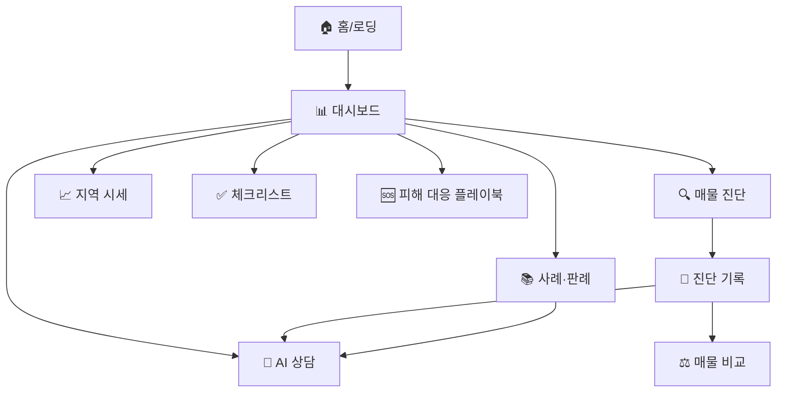

SKN27-3rd-4TEAM
# 🏠 전세계약 위험 진단 및 전세사기 예방 에이전트

> 서울 종로구 실거래가 데이터와 주택임대차 법령·판례 RAG를 결합해 전세계약의 **가격 위험**과 **계약 위험**을 진단하는 AI 에이전트

---

## 👥 팀원 소개
|||||||
|--------|--------|--------|--------|--------|--------|
| 김재묵 (팀장) | 김한솔 | 박준희 | 박창제 | 오주희 | 주연중
|-|-|-|-|-|-|

SKN27-3rd-4TEAM
# 🏠 전세계약 위험 진단 및 전세사기 예방 에이전트

> 서울 종로구 실거래가 데이터와 주택임대차 법령·판례 RAG를 결합해 전세계약의 **가격 위험**과 **계약 위험**을 진단하는 AI 에이전트

---

## 1. 팀 소개


## 👥 팀원 소개
|||||||
|--------|--------|--------|--------|--------|--------|
| 김재묵 (팀장) | 김한솔 | 박준희 | 박창제 | 오주희 | 주연중
|-|-|-|-|-|-|

---
## 2. 프로젝트 개요
> 목적: 사용자가 계약 정보를 입력하거나 계약 관련 문서를 업로드했을 때 아래 위험 요소를 함께 확인할 수 있도록 설계
 - 주변 실거래 매매가 대비 전세가 적정 수준 분석
 - 동일 동·주택유형·면적구간 기준 최근 시세대비 위험 여부
 - 2년 뒤 계약 만기 시점에 보증금 회수 위험 가능성
 - 법률·판례·특약 관점 추가 검토 필요 여부
> 차별점: 단순 시세 비교가 아닌 가격 모델 + 등기·계약서 분석 + 법령·판례 RAG 3축 결합  
> 범위: 서울 종로구 연립다세대·오피스텔 (2016–2025 실거래)  
> 사용자 흐름: 계약 정보·서류 입력 → 위험도 산정 → 근거 문서 인용 → 체크리스트 제공

### 2-1. 프로젝트 목표

| 목표 | 설명 |
|---|---|
| 가격 기반 위험도 산정 | 실거래가 기반으로 현재 시세 및 24개월 뒤 예측 매매가 대비 전세가율 계산 |
| 데이터 누수 방지 모델 검증 | horizon별 purge gap을 적용해 train label과 valid 구간의 미래 정답 중첩 차단 |
| 모델 에이전트 인터페이스 제공 | Supervisor가 호출할 수 있는 analyze_contract(contract_info) 함수 제공 |
| 문서 기반 근거 제공 | 법령·판례·상담 사례 PDF를 RAG 문서 데이터로 적재 |
| 사용자용 화면 구성 | Streamlit 기반 대시보드, 챗봇, 체크리스트, 사례/판례 제공|


---

## 3. 기술 스택

| 분류 | 기술 |
|---|---|
| Language | Python 3.11 |
| Frontend | Streamlit, Plotly, HTML/CSS |
| Data Processing | pandas, numpy, PublicDataReader |
| Machine Learning | scikit-learn, LightGBM, XGBoost, CatBoost, joblib |
| Deep Learning 분석 | PyTorch, pytorch-tabnet |
| RAG/PDF | LangChain, PyMuPDF4LLM, pdfplumber, pypdf, ChromaDB |
| Database | PostgreSQL, psycopg2, SQLAlchemy |
| Infra | Docker, docker-compose, cron |
| LLM 연동 | OpenAI API, LangChain OpenAI |

---

## 4. 시스템 아키텍처

flowchart LR
    U[사용자] --> FE[Streamlit Frontend]
    FE --> SV[Supervisor Agent]
    SV --> MA[모델 Agent]
    SV --> LA[법률·RAG Agent]
    SV --> TA[특약 Agent]
    MA --> ML[(24m LightGBM)]
    MA --> MD[월별 패널]
    LA --> RAG[(rag_documents)]
    TA --> RAG
    RAG --> PDF[법령·판례 66개]
    MD --> CSV[종로구 실거래 CSV]
    CSV --> DB[(PostgreSQL)]
    PDF --> DB

### 4-1. 에이전트 구성

- **Supervisor**: 사용자 입력 라우팅 + 종합 답변 생성
- **Model Agent**: 가격 위험도 산정 (`analyze_contract()`)
- **Legal Agent**: 법령·판례 RAG 검색
- **Terms Agent**: 계약서 특약 위험 검토

---

## 5. 주요 기능

| 기능 | 설명 |
|------|------|
| 가격 위험도 진단 | 24개월 예측 매매가 대비 전세가율 산정 |
| 면적구간 시세 비교 | 동·주택유형·면적별 최근 12개월 시세 비교 |
| 등기·계약서 분석 | `.docx` 업로드 → 근저당·압류·특약 자동 추출 |
| 법령·판례 RAG | 66개 PDF chunk 검색·인용 |
| 시나리오 시뮬레이터 | 경매 시 보증금 회수율 슬라이더 |
| 계약 체크리스트 | 계약 전·당일·이사일·기간 중 단계별 점검 |
| 진단 기록 비교 | 이전 매물 즐겨찾기 + 2매물 나란히 비교 |
| AI 상담 챗봇 | 문서 컨텍스트 기반 RAG 응답 |


---

## 6. 데이터 구성

### 6.1 실거래가

| 구분 | 내용 |
|---|---|
| 기간 | 2016년~2025년 |
| 지역 | 서울특별시 종로구 |
| 유형 | 전세, 매매 / 연립다세대, 오피스텔 |
| 주요 컬럼 | 동, 지번, 전용면적, 보증금/매매가, 층, 건축연도, 계약일 |
| 파일 수수 | 40개 CSV |

### 6.2 RAG 문서 데이터

| 구분 | 파일 수 | 예시 |
|---|---:|---|
| 법령/서식/상담 사례 | 8개 | 주택임대차보호법, 주택임대차표준계약서, 전세피해 법률상담 사례집 |
| 판례 | 157개 | 전세사기, 보증금 반환, 임대차 분쟁 관련 판결문 |
| 합계 | 165개 | PDF 기반 RAG 적재 대상 |

---

## 7. 머신러닝 모델

### 학습 단위
> 동 + 주택유형 + 월 (예: 신영동 villa 2025-05)

각 월별 매매 평당가, 전세 평당가, 거래 수, 평균 층수, 평균 건물연식, 전세가율, 과거 lag/rolling 변수 생성

## 각 horizon별로 아래 모델을 비교

| 모델 | 설명 |
|---|---|
| LightGBM | Gradient Boosting 기반 회귀 모델 |
| XGBoost | Gradient Boosting 기반 회귀 모델 |
| CatBoost | 범주형 변수 처리에 강한 Boosting 모델 |
| HistGradientBoosting | scikit-learn 기반 boosting 모델 |
| RandomForest | Bagging 기반 tree ensemble |
| ExtraTrees | 무작위 분할 기반 tree ensemble |
| Ensemble Mean | LightGBM + CatBoost + XGBoost 평균 앙상블 |

### Horizon별 최종 결과

| Horizon | Best Model | Valid MAPE | Baseline | 개선 | ROC-AUC | F1 |
|---------|------------|------------|----------|------|---------|----|
| 1m  | ExtraTrees   | 16.31% | 14.40% | ✗ | 0.894 | 0.8125 |
| 3m  | ExtraTrees   | 21.37% | 20.29% | ✗ | 0.846 | 0.7530 |
| 6m  | RandomForest | 23.84% | 26.16% | ✓ | 0.818 | 0.7331 |
| 12m | ExtraTrees   | 24.95% | 29.73% | ✓ | 0.816 | 0.6876 |
| 24m | **LightGBM** | **27.03%** | 29.63% | ✓ | 0.795 | 0.6218 |

### 최종 채택: 24개월 LightGBM
- 전세 만기 2년과 직접 매칭
- 24m 후보 중 Valid MAPE 최저
- 데이터 누수 차단: horizon별 purge gap 적용 (train·valid 라벨 미래 중첩 0건)

> `overfit_severe=True` 경고 → **모델 단독 판단 지양**, 법률·특약 검토 병행


## 모델 에이전트 인터페이스

```python
from machine_learning.model_agent import analyze_contract
result = analyze_contract(contract_info)
```

**Input (필수 5개)**

- `address`, `dong_name`, `property_type`, `contract_date`, `deposit_amount_manwon`, `exclusive_area_m2`, `floor`

**Output 핵심 필드**

- `forecast_check.primary.forecast_risk_level` — 안전 / 주의 / 위험 가능성 높음
- `price_evidence.supporting_evidence` — 현재시세 + 면적구간별 평당 시세
- `final_market_risk` — 종합 판정

**예외 처리**

- 필수값 누락 → `need_more_info` 반환
- 반지하/지하 → `excluded_case` 반환 


## 8. 화면 설계 (Streamlit)

### 화면 흐름도



| 화면 | 파일 | 핵심 기능 |
|------|------|----------|
| 홈 (로딩)   | `views/home.py`       | 진입 안내 |
| 대시보드    | `views/dashboard.py`  | 지역 시세 지도 + 메트릭 |
| AI 상담     | `views/chat.py`       | docx 업로드 + RAG 챗 |
| 진단 기록   | `views/history.py`    | 즐겨찾기 + 매물 비교 |
| 매물 상세   | `views/property.py`   | 위험 신호 + 유사 사례 |
| 사례·판례   | `views/cases.py`      | RAG 문서 검색 + 챗봇 연동 |
| 피해 대응   | `views/playbook.py`   | 상황별 단계 가이드 |
| 체크리스트  | `views/checklist.py`  | 단계별 점검표 |
| 지역 시세   | `views/market.py`     | 동별 시세 |

> 라우팅: 사이드바 클릭 → st.session_state.current_view 갱신 → 부드러운 rerun (URL 새로고침 없음)

---

## 9. 데이터베이스 스키마

| 테이블 | 용도 |
|--------|------|
| `jeonse_transactions` | 전세 실거래 |
| `sale_transactions`   | 매매 실거래 |
| `price_ratio`         | 동·유형·면적별 전세가율 |
| `rag_documents`       | PDF chunk |
| `diagnosis_logs`      | 진단 요청·결과 로그 |

---

## 10. 프로젝트 구조

SKN27-3rd-4TEAM/
├── data/                      종로구 실거래 CSV (40개)
├── database/schema.sql        PostgreSQL DDL
├── docs/pdf/                  RAG PDF (66개)
├── frontend/                  Streamlit UI
│   ├── app.py
│   ├── views/
│   └── utils/
├── backend/                   FastAPI 서버
│   └── rag_server/core/       LLM · RAG 파이프라인
├── machine_learning/
│   ├── can_jeonse_forecast.py
│   ├── model_agent.py
│   ├── artifacts/can_jeonse/
│   └── docs/
├── deep_learning/             TabNet · LSTM 실험
├── rag/
│   ├── scripts/               PDF·CSV·API 적재
│   ├── ingestion/             clean_chunks · build_graph · load_market_data
│   ├── jm/core/               청킹 설정
│   └── ragas_test*.py         RAG 평가
├── docker-compose.yml
└── requirements.txt

---

## 11. 실행 방법

### 11-1. 환경변수 (`.env`)

```env
DB_HOST=localhost
DB_PORT=5432
DB_NAME=jeonse_risk
DB_USER=postgres
DB_PASSWORD=********
OPENAI_API_KEY=sk-...
PUBLIC_DATA_API_KEY=...
BACKEND_BASE_URL=http://127.0.0.1:8000
```

### 11-2. 브랜치 체크아웃

```bash
git fetch --all
git switch pcj_haha
```

### 11-3. 의존성 설치

```bash
.\.venv\Scripts\activate
uv pip install -r requirements.txt --index-strategy unsafe-best-match
```

### 11-4. DB + 데이터 적재

```bash
docker-compose up --build
python rag/scripts/pdf_pipeline.py
```

### 11-5. Streamlit 실행

```bash
streamlit run frontend/app.py
```

### 11-6. (선택) 모델 재학습

```bash
python machine_learning/can_jeonse_forecast.py        # 전체 horizon
python machine_learning/can_jeonse_forecast_24m.py    # 24m만
python machine_learning/model_agent.py --demo         # 에이전트 단독 테스트
```

---
## 12. 평가 항목별 구현 요약

| 평가 항목 | 구현 수준 |
|-----------|-----------|
| 1. RAG 환각 방지 & 출처 표시 | ✅ 시스템 프롬프트 + 리랭킹 + references 필드 |
| 2. RDB · GraphDB 설계 | ✅ JSONB · 8종 노드 · 15+종 관계 |
| 3. VectorDB 청킹 기준 | ✅ 유형별 차등 + 2단계 정제 | 
| 4. 데이터 수집 & 전처리 | ✅ 5종 데이터 · 관련성 필터 · NaN 처리 |
| 5. 시퀀스 다이어그램 | ✅ 진단·RAG·학습 3종 |
| 6. 화면 설계서 | ✅ 흐름도 + 화면별 명세 + 와이어프레임 
| 7. 테스트 시나리오 | ✅ RAGAS + 기능 10건 + 성능 + 부하 |

---
## 13. 한계 및 주의

- 지역 한정: 서울 **종로구만** 지원
- 학습 단위는 **시장 평균** (개별 매물 감정가 아님)
- 반지하·지하 제외
- 24m LightGBM `overfit_severe` 경고 → 단독 판단 금지
- 권리관계·법률 판단은 **전문가 검토 병행 필수**
- 본 서비스는 **의사결정 보조 도구**

---

## 참고

- 구조 참고: SKN24-3rd-3Team
- 데이터 출처: 국토교통부 실거래가 공개시스템 · 대법원 종합법률정보 · 공공데이터포털털

---

## ⭐ 한줄회고
- 김재묵
- 김한솔
- 박준희
- 박창제
- 오주희
- 주연중
