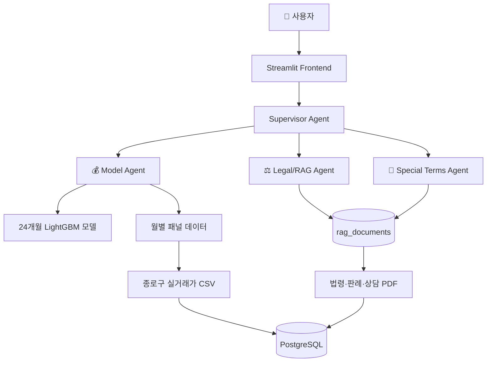

# SKN27-3rd-4TEAM

# 🏠 전세계약 위험 진단 및 전세사기 예방 에이전트

> 서울 종로구 실거래가 데이터와 주택임대차 법령·판례 RAG를 결합해 전세계약의 **가격 위험**과 **계약 위험**을 진단하는 AI 에이전트

[](https://github.com/SKNETWORKS-FAMILY-AICAMP/SKN27-3rd-4TEAM)

---

## 📌 목차

1. [팀 소개](#1-팀-소개)
2. [프로젝트 개요](#2-프로젝트-개요)
3. [기술 스택](#3-기술-스택)
4. [시스템 아키텍처](#4-시스템-아키텍처)
5. [주요 기능](#5-주요-기능)
6. [데이터 및 모델](#6-데이터-및-모델)
7. [실행 방법](#7-실행-방법)
8. [프로젝트 구조](#8-프로젝트-구조)
9. [한계 및 주의사항](#9-한계-및-주의사항)

---

## 1. 팀 소개

<!-- 팀원 정보 작성 영역 -->

## 👥 팀원 소개
|||||||
|--------|--------|--------|--------|--------|--------|
| 김재묵 (팀장) | 김한솔 | 박준희 | 박창제 | 오주희 | 주연중
|-|-|-|-|-|-|
---

## 2. 프로젝트 개요

### 2.1 프로젝트 소개

- 전세 계약 시 **보증금 회수 위험**을 사전에 점검하는 AI 진단 서비스
- 계약 정보(주소, 보증금, 면적 등) 입력 → 가격·법률·특약 위험을 종합 분석
- 사용자에게 **근거, 위험 요인, 추가 확인 항목**을 구조화하여 제공

### 2.2 프로젝트 필요성

- 전세사기는 보증금 액수만으로 판단 불가
- 매매가, 선순위 권리, 보증보험 가입 가능성, 특약 조항 등 **복합 요소** 검토 필요
- 가격 모델 + 문서 기반 RAG + 체크리스트 UI를 결합해 위험 요소를 통합 진단

### 2.3 프로젝트 목표

| 목표 | 설명 |
|---|---|
| 🎯 가격 위험도 산정 | 실거래가 기반 시세 및 24개월 뒤 예측 매매가 대비 전세가율 계산 |
| 🔒 데이터 누수 방지 | horizon별 purge gap 적용해 train/valid 미래 정답 중첩 차단 |
| 🤖 에이전트 인터페이스 | `analyze_contract(contract_info)` 함수로 Supervisor 연동 |
| 📚 근거 기반 답변 | 법령·판례·상담 사례 PDF 기반 RAG 구축 |
| 🖥️ 사용자 화면 | Streamlit 기반 대시보드, 챗봇, 체크리스트, 시뮬레이터 제공 |

---

## 3. 기술 스택

| 분류 | 기술 |
|---|---|
| **Language** | Python 3.11 |
| **Frontend** | Streamlit, Plotly |
| **Data** | pandas, numpy, PublicDataReader |
| **ML** | scikit-learn, LightGBM, XGBoost, CatBoost |
| **DL** | PyTorch, pytorch-tabnet |
| **RAG** | LangChain, PyMuPDF4LLM, pdfplumber, ChromaDB |
| **DB** | PostgreSQL, SQLAlchemy |
| **Infra** | Docker, docker-compose |
| **LLM** | OpenAI API |

---

## 4. 시스템 아키텍처



### 4.1 에이전트 구성

| 에이전트 | 역할 | 상태 |
|---|---|:---:|
| **Model Agent** | 가격 위험도 계산 | ✅ 완료 |
| **Legal Agent** | 법령·판례 RAG 검색 | ✅ 완료 |
| **Terms Agent** | 특약 문구 위험성 검토 | 🔄 연동 중 |
| **Supervisor** | 라우팅 및 종합 답변 생성 | 📋 설계 완료 |

---

## 5. 주요 기능

| 기능 | 설명 |
|---|---|
| 📊 실거래가 전처리 | 2016~2025년 종로구 연립다세대·오피스텔 거래 데이터 처리 |
| 🚫 지하/반지하 제외 | `floor < 0` 거래 학습/시세 산출 제외 |
| 📈 24개월 매매가 예측 | 전세계약 만기(2년)에 맞춘 매매 평당가 예측 |
| ⚠️ 가격 위험도 계산 | 계약 전세 평당가 / 24개월 예측 매매 평당가 |
| 🔍 면적구간 시세 비교 | 동일 동·유형·면적구간 최근 12개월 시세 비교 |
| 📉 저전세가율 탐지 | 비정상적으로 낮은 전세가율 케이스 별도 표시 |
| 📄 법령·판례 RAG | 주택임대차 PDF chunk 단위 적재 및 검색 |
| 🖼️ Streamlit UI | 홈, 챗봇, 대시보드, 체크리스트, 시뮬레이터 |

---

## 6. 데이터 및 모델

### 6.1 데이터 구성

**실거래가 데이터**
- 기간: 2016~2025년 / 지역: 서울 종로구
- 유형: 전세·매매 (연립다세대, 오피스텔)
- 정규화 거래: **21,329건** / 월별 패널: **4,604행**

**RAG 문서 데이터**

| 구분 | 파일 수 | 예시 |
|---|---:|---|
| 법령·서식·상담 | 8개 | 주택임대차보호법, 표준계약서, 피해상담 사례집 |
| 판례 | 58개 | 전세사기, 보증금 반환, 임대차 분쟁 판결문 |
| **합계** | **66개** | RAG 적재 대상 |

### 6.2 최종 모델: 24개월 LightGBM

- 선정 이유: 일반적인 전세계약 만기(2년)와 직접 연결
- horizon 후보 중 가장 낮은 Valid MAPE 기록

```text
최종 가격 위험도 = 계약 전세 평당가 / 24개월 LightGBM 예측 매매 평당가
```

### 6.3 모델 성능 비교

| Horizon | Best Model | Valid MAPE | Baseline 개선 | ROC-AUC |
|---:|---|---:|:---:|---:|
| 1개월 | ExtraTrees | 16.31% | ❌ | 0.8938 |
| 3개월 | ExtraTrees | 21.37% | ❌ | 0.8460 |
| 6개월 | RandomForest | 23.84% | ✅ | 0.8175 |
| 12개월 | ExtraTrees | 24.95% | ✅ | 0.8155 |
| **24개월** | **LightGBM** | **27.03%** | ✅ | **0.7946** |

### 6.4 데이터 누수 방지

- 모든 horizon에 **purge gap** 적용 → train 라벨과 valid 구간 중첩 차단
- 24개월 모델은 `overfit_severe=True` 경고 존재 → 단독 판단 금지, 시세·법률 검토와 병행

### 6.5 모델 에이전트 사용

```python
from machine_learning.model_agent import analyze_contract

result = analyze_contract({
    "address": "서울특별시 종로구 신영동 179-21",
    "dong_name": "신영동",
    "property_type": "villa",
    "contract_date": "2025-05-12",
    "deposit_amount_manwon": 28600,
    "exclusive_area_m2": 42.39,
    "floor": 3,
    "is_basement": False
})
```

**출력 예시**

```json
{
  "status": "success",
  "forecast_check": {
    "primary": {
      "horizon_months": 24,
      "model_name": "lightgbm",
      "forecast_risk_ratio": 1.0569,
      "forecast_risk_level": "깡통 가능성 매우 높음"
    }
  },
  "final_market_risk": "깡통 가능성 매우 높음"
}
```

---

## 7. 실행 방법

### 7.1 환경변수 설정 (`.env`)

```env
DB_HOST=localhost
DB_PORT=5432
DB_NAME=jeonse_risk
DB_USER=postgres
DB_PASSWORD=your_password
PUBLIC_DATA_API_KEY=your_public_data_api_key
OPENAI_API_KEY=your_openai_api_key
```

### 7.2 패키지 설치

```powershell
.\.venv\Scripts\activate
uv pip install -r .\requirements.txt --index-strategy unsafe-best-match
```

### 7.3 Streamlit 실행

```powershell
streamlit run .\frontend\app.py
```

### 7.4 Docker로 DB 및 파이프라인 실행

```powershell
docker-compose up --build
```

### 7.5 RAG PDF 적재

```powershell
python .\rag\scripts\pdf_pipeline.py
```

### 7.6 머신러닝 학습

```powershell
# 전체 horizon 학습
python .\machine_learning\can_jeonse_forecast.py

# 24개월 모델만 학습
python .\machine_learning\can_jeonse_forecast_24m.py

# 모델 에이전트 데모
python .\machine_learning\model_agent.py --demo
```

---

## 8. 프로젝트 구조

```text
SKN27-3rd-4TEAM/
├── data/                          # 종로구 전세·매매 CSV
├── database/
│   └── schema.sql                 # PostgreSQL DDL
├── docs/
│   └── pdf/                       # RAG용 법령·판례 PDF
├── frontend/                      # Streamlit UI
│   ├── app.py
│   ├── views/                     # 홈/대시보드/챗봇/체크리스트 등
│   └── utils/
├── machine_learning/              # 최종 ML 모델
│   ├── can_jeonse_forecast.py
│   ├── model_agent.py
│   ├── artifacts/can_jeonse/
│   └── docs/
├── deep_learning/                 # TabNet/LSTM 실험
├── rag/
│   └── scripts/                   # CSV/API/PDF 적재 파이프라인
├── Dockerfile
├── docker-compose.yml
└── requirements.txt
```

### 주요 산출물

| 경로 | 설명 |
|---|---|
| `artifacts/can_jeonse/metrics.csv` | horizon·모델별 평가 결과 |
| `artifacts/can_jeonse/best_models.csv` | horizon별 best model 요약 |
| `artifacts/can_jeonse/growth_24m_best_model.joblib` | 최종 서비스 모델 |
| `artifacts/can_jeonse/monthly_panel.csv` | 월별 학습 패널 |
| `docs/MODEL_AGENT_IMPLEMENTATION_GUIDE.md` | 에이전트 입출력 가이드 |

---

## 9. 한계 및 주의사항

> ⚠️ 본 서비스는 **의사결정 보조 도구**이며, 최종 계약 전 공인중개사·법률 전문가 검토가 필요합니다.

- 📍 **지역 범위 한정**: 현재 서울 종로구만 지원
- 📊 **시장 단위 모델**: 개별 매물 감정가가 아닌 동·유형·월 단위 시장 데이터 사용
- 🏚️ **반지하/지하 제외**: 가격 구조가 달라 모델 적용 대상에서 제외
- ⚠️ **24개월 LightGBM 경고**: 데이터 누수는 차단되었으나 overfit severe 경고 존재 → 단독 판단 금지
- ⚖️ **법률 판단 한계**: 가격 모델만으로 권리관계 확정 불가 → 법률/특약 검토와 병행 해석

---

## 📎 참고

- **레포지토리**: [SKN27-3rd-4TEAM](https://github.com/SKNETWORKS-FAMILY-AICAMP/SKN27-3rd-4TEAM)
- **참고 README**: [SKN24-3rd-3Team](https://github.com/SKNETWORKS-FAMILY-AICAMP/SKN24-3rd-3Team)
