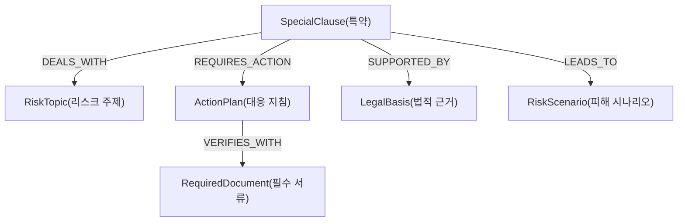
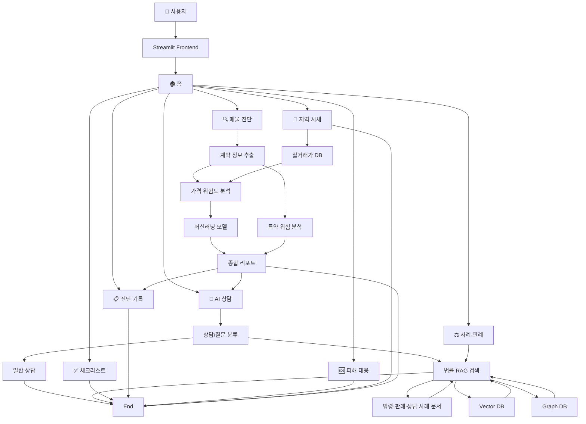
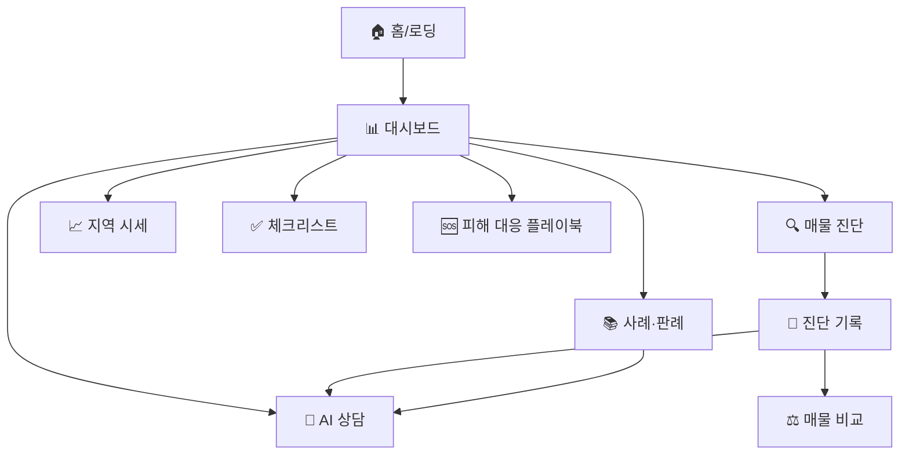

SKN27-3rd-4TEAM
# 🏠 전세계약 위험 진단 및 전세사기 예방 에이전트

> 서울 종로구 실거래가 데이터와 주택임대차 법령·판례 RAG를 결합해 전세계약의 **가격 위험**과 **계약 위험**을 진단하는 AI 에이전트

---

## 1. 팀 소개


## 👥 팀원 소개
|||||||
|--------|--------|--------|--------|--------|--------|
| 김재묵 (팀장) | 김한솔 | 박준희 | 박창제 | 오주희 | 주연중
|-|-|-|-|-|-|

---
## 2. 프로젝트 개요
> 목적: 사용자가 계약 정보를 입력하거나 계약 관련 문서를 업로드했을 때 아래 위험 요소를 함께 확인할 수 있도록 설계
 - 주변 실거래 매매가 대비 전세가 적정 수준 분석
 - 동일 동·주택유형·면적구간 기준 최근 시세대비 위험 여부
 - 2년 뒤 계약 만기 시점에 보증금 회수 위험 가능성
 - 법률·판례·특약 관점 추가 검토 필요 여부
> 차별점: 단순 시세 비교가 아닌 가격 모델 + 등기·계약서 분석 + 법령·판례 RAG 3축 결합  
> 범위: 서울 종로구 연립다세대·오피스텔 (2016–2025 실거래)  
> 사용자 흐름: 계약 정보·서류 입력 → 위험도 산정 → 근거 문서 인용 → 체크리스트 제공

### 2-1. 프로젝트 목표

| 목표 | 설명 |
|---|---|
| 가격 기반 위험도 산정 | 실거래가 기반으로 현재 시세 및 24개월 뒤 예측 매매가 대비 전세가율 계산 |
| 데이터 누수 방지 모델 검증 | horizon별 purge gap을 적용해 train label과 valid 구간의 미래 정답 중첩 차단 |
| 모델 에이전트 인터페이스 제공 | Supervisor가 호출할 수 있는 analyze_contract(contract_info) 함수 제공 |
| 문서 기반 근거 제공 | 법령·판례·상담 사례 PDF를 RAG 문서 데이터로 적재 |
| 사용자용 화면 구성 | Streamlit 기반 대시보드, 챗봇, 체크리스트, 사례/판례 제공|


---

## 3. 기술 스택

| 분류 | 기술 |
|---|---|
| Language | Python 3.11 |
| Frontend | Streamlit, Plotly, HTML/CSS |
| Data Processing | pandas, numpy, PublicDataReader |
| Machine Learning | scikit-learn, LightGBM, XGBoost, CatBoost, joblib |
| Deep Learning 분석 | PyTorch, pytorch-tabnet |
| RAG/PDF | LangChain, PyMuPDF4LLM, pdfplumber, pypdf, ChromaDB |
| Database | PostgreSQL, psycopg2, SQLAlchemy |
| Infra | Docker, docker-compose, cron |
| LLM 연동 | OpenAI API, LangChain OpenAI |

---

## 4. 시스템 아키텍처
```
flowchart LR
    U[사용자] --> FE[Streamlit Frontend]
    FE --> SV[Supervisor Agent]
    SV --> MA[모델 Agent]
    SV --> LA[법률·RAG Agent]
    SV --> TA[특약 Agent]
    MA --> ML[(24m LightGBM)]
    MA --> MD[월별 패널]
    LA --> RAG[(rag_documents)]
    TA --> RAG
    RAG --> PDF[법령·판례·사례집 1개]
    MD --> CSV[종로구 실거래 CSV]
    CSV --> DB[(PostgreSQL)]
    PDF --> DB
```

### 4-1. 시퀀스 다이어그램 

#### 1. 계약서 진단 파이프라인 (LangGraph 워크플로우)


#### 2. AI 챗봇 상담 흐름


#### 3. 그래프 빌드 (오프라인 1회)


### 4-2. ERD


---

## 5. 주요 기능

| 기능 | 설명 |
|------|------|
| 가격 위험도 진단 | 24개월 예측 매매가 대비 전세가율 산정 |
| 면적구간 시세 비교 | 동·주택유형·면적별 최근 12개월 시세 비교 |
| 등기·계약서 분석 | `.docx` 업로드 → 근저당·압류·특약 자동 추출 |
| 법령·판례 RAG | 66개 PDF chunk 검색·인용 |
| 계약 체크리스트 | 계약 전·당일·이사일·기간 중 단계별 점검 |
| 진단 기록 비교 | 이전 매물 즐겨찾기 + 2매물 나란히 비교 |
| AI 상담 챗봇 | 문서 컨텍스트 기반 RAG 응답 |

---

## 6. 데이터 구성

### 6.1 실거래가

| 구분 | 내용 |
|---|---|
| 기간 | 2016년~2025년 |
| 지역 | 서울특별시 종로구 |
| 유형 | 전세, 매매 / 연립다세대, 오피스텔 |
| 주요 컬럼 | 동, 지번, 전용면적, 보증금/매매가, 층, 건축연도, 계약일 |
| 파일 수 | 40개 CSV | 
| 출처 | 국토교통부 실거래가 공개시스템 (rt.molit.go.kr) | 

> 파일 구성: 10개년(2016~2025) × 주택유형 2종(연립다세대·오피스텔) × 거래유형 2종(전세·매매) = 40개


### 6.2 RAG 문서 데이터

| 구분 | 파일 수 | 예시 |
|---|---:|---|
| 법령/서식/상담 사례 | 8개 | 주택임대차보호법, 주택임대차표준계약서, 전세피해 법률상담 사례집 |
| 판례 | 157개 | 전세사기, 보증금 반환, 임대차 분쟁 관련 판결문 |
| 합계 | 165개 | PDF 기반 RAG 적재 대상 |


### 6.3 데이터 전처리

#### 6.3.1 실거래 CSV 전처리 파이프라인 (backend/data_loader.py)
1단계 — 통합 로딩
- 40개 CSV → pandas concat
- 파일명 prefix(연도) 파싱 → year 컬럼 추가
- officetel_name / house_name → building_name 으로 통일
- housing_type = "오피스텔" | "연립다세대"
- 전세 데이터는 monthly_rent == 0 필터 (순수 전세만 유지)

2단계 — 면적 구간화 (area_bucket())
- ~33㎡ (원룸급)
- 33~66㎡ (소형)
- 66~99㎡ (중형)
- 99㎡~ (대형)

3단계 — 2027 예측 (generate_predictions())
- (dong_name, area_bucket, year) 그룹별 평균 deposit/sale 산출
- CAGR 계산: (last_val / first_val)^(1/n) - 1
- 2025 기준 × (1 + CAGR)^2 → 2027 예측값
- 전세가율 = 예측전세금 / 예측매매가 × 100
- 위험도: ≥80% 위험 · ≥70% 주의 · 그 외 안전

결측·이상치 처리
  - 동 데이터 부족 (2건 미만) → 예측 스킵
  - 매매가 결측 → predicted_sale_2027=None, 위험도 "미상"
  - 반지하/지하층(floor < 0) 거래 제외


#### 6.3.2 머신러닝 학습 데이터 가공

| 단계 | 처리 내용 |
|---|---|
| 거래 유형 구분 | 파일명 기준 전세/매매 구분 |
| 주택유형 정규화 | 연립다세대 → `villa`, 오피스텔 → `officetel` |
| 반전세 제외 | 전세 데이터 중 `monthly_rent > 0` 거래 제외 |
| 평당가 변환 | `price_per_pyeong = price_amount / exclusive_area_pyeong` |
| 월별 패널 생성 | `dong + property_type + month` 단위로 집계 |
| lag / rolling | 과거 매매가 lag + 3·6·12개월 이동평균 |
| 미래 target | 1·3·6·12·24개월 뒤 매매가 성장률 |

#### 최종 산출물

| 산출물 | 행 수 |
|---|---:|
| `transactions_normalized.csv` | 21,329건 |
| `monthly_panel.csv` | 4,604행 |


#### 6.3.3 판례 PDF 전처리

```
PDF → PyMuPDF로 본문 추출 → 2,000자 truncate → LLM JSON 구조화 추출
                                              ↓
파일명 정규식 폴백 (LLM 실패 시):
  - 법원: "대법원|헌법재판소|...고법"
  - 날짜: r'(\d{4})\.\s*(\d{1,2})...'
                                              ↓
  CaseEntity { case_id, court, date, summary,
               cited_laws, cited_cases, issues }
                                              ↓
                                      Neo4j MERGE 삽입
```
| 항목 | 내용 |
|---|---|
| 청킹 단위 | 1 PDF = 1 Case 엔티티 (사건번호 단위 의미 보존) |
| 최대 입력 길이 | 한글 2,000자 (GPT-4o-mini 비용·지연 절충) |
| 추출 메타데이터 | `case_id`, `court`, `date`, `summary`, `cited_laws`, `cited_cases`, `issues` |
| 폴백 처리 | LLM 실패 시 파일명 정규식 파싱 + `summary="LLM 추출 실패 - 파일명 기본 정보만 추출"` |


### 6.4 RAG
> "LLM이 판례를 지어내지 못하도록" **검색 → 인용 → 응답** 3단 파이프라인을 강제하는 Graph RAG 구조

### 6.4.1 환각(Hallucination) 방지 전략

#### (A) 검색 우선(Retrieval-First) 구조

`backend/agents/legal_agent.py`

```text
사용자 질문
   ↓ (1) LLM이 쟁점 키워드만 추출   ← JSON 배열 강제, 사전 정의 25개 중 선택
   ↓ (2) Neo4j 그래프에서 실제 판례 검색
   ↓ (3) 검색된 판례 텍스트를 컨텍스트로 LLM에 전달
   ↓ (4) "근거 자료 없음 → 그렇게 답변" 규칙 적용
최종 답변 (사건번호·법조문 인용)
```

- **1단계**: LLM은 사전 정의 25개 키워드 중에서만 선택 가능
  - 보증금반환, 대항력, 우선변제권, 근저당, 전세권, 임차권등기, 확정일자, 사기죄, 배임, 경매, 신탁 등
- **2단계**: 추출된 키워드로 Neo4j가 실제 저장된 판례 매칭
- **3단계**: LLM은 검색 결과 텍스트만 보고 답변 생성

#### (B) 프롬프트 레벨 가드레일

- `LEGAL_PROMPT`: "사건번호·판결요지 구체 인용" / "확실하지 않으면 전문가 상담 권고" / "법률 자문 아닌 정보 제공임 명시"
- `temperature=0.0` (쟁점 추출), `temperature=0.3` (응답 생성) — 창의성 최소화
- 검색 결과 0건 시: "관련 판례를 찾지 못했습니다." 메시지 그대로 컨텍스트 주입 → 임의 판례 생성 차단

#### (C) 두 단계 분류로 RAG 트리거 격리

`backend/agents/chatbot.py`

- `classify_question()` → `legal` / `general` 분류
- 법률 질문일 때만 RAG 경로(`LEGAL_ENHANCED_PROMPT`) 전환
- 일반 질문은 진단 데이터 컨텍스트만 사용 → RAG 오남용 방지

#### (D) 구조화 출력 강제

- 모든 LLM 호출은 Pydantic 모델 + JSON 형식 강제
- 파싱 실패 시 정규식 백업 폴백 (`parse_case_info_from_filename()`)

---

### 6.4.2 출처(Citation) 표시

**데이터 모델** — `LegalReference`

```python
class LegalReference(BaseModel):
    case_id: str       # 예: "2022다48327"
    court: str         # 법원명
    date: str          # 판결일
    summary: str       # 판결 요지
    laws: list[str]    # 인용 법조문
```

**UI 노출** — 챗봇 응답 하단에 근거 칩 형태로 표시

```python
sources.append({"type": "case", "text": f"⚖️ {ref.court} {ref.case_id}"})
sources.append({"type": "law",  "text": f"📜 {law}"})
```

**진단 리포트 영구 저장** — `reports/report_*.json`의 `special_terms[].related_cases` / `related_laws` 필드에 인용된 모든 사건번호·법조문 기록 → 사후 추적·감사 가능

---

### 6.4.3 Neo4j 지식 그래프 스키마

> 전세 리스크 방어 Master Schema v2.0



**노드 라벨 (6종)**

| 라벨 | 주요 속성 | 설명 |
|---|---|---|
| `SpecialClause` | text, severity, validity, user_msg | 특약 원문 + AI 진단 결과 (핵심 노드) |
| `RiskTopic` | name | 리스크 카테고리 (대항력, 세금, 수선비 등) |
| `ActionPlan` | guide | 임차인 행동 매뉴얼 |
| `LegalBasis` | reference | 법령 조항·판례 번호 |
| `RiskScenario` | outcome | 방치 시 실제 피해 사례 |
| `RequiredDocument` | name | 조치 이행 증빙 서류 |

**관계 (5종)**

| 관계 | 의미 |
|---|---|
| `DEALS_WITH` | 특약 → 주제별 분류로 상황 맞춤 조언 |
| `REQUIRES_ACTION` | 위험 탐지 시 즉각 해결책 제시 |
| `SUPPORTED_BY` | 진단 신뢰도를 법적 근거로 뒷받침 |
| `LEADS_TO` | 리스크 심각성을 시각화 경고 |
| `VERIFIES_WITH` | 행동 지침을 증빙 서류로 연결 |

> **활용 흐름**: 사용자 특약 입력 → 그래프 traverse → **[진단 → 이유 → 피해 → 해결책 → 증빙]** 완결 논리 리포트 생성

### 6.4.4 판례 그래프 스키마 (Case 중심 보조 그래프)

```cypher
// Nodes
(:Case  {case_id, court, date, summary, filename})
(:Law   {name})       // 예: "주택임대차보호법 제3조"
(:Issue {name})       // 예: "보증금반환", "대항력"

// Relationships
(Case)-[:CITES_LAW]->(Law)
(Case)-[:CITES_CASE]->(Case)    // 판례 인용 네트워크
(Case)-[:DEALS_WITH]->(Issue)

// Constraints
CREATE CONSTRAINT FOR (c:Case)  REQUIRE c.case_id IS UNIQUE;
CREATE CONSTRAINT FOR (l:Law)   REQUIRE l.name IS UNIQUE;
CREATE CONSTRAINT FOR (i:Issue) REQUIRE i.name IS UNIQUE;
```

**그래프 통계 (현재 빌드 기준)**

| 항목 | 수치 |
|---|---:|
| Case 노드 | 157개 (대법원·고등법원·헌법재판소 판례) |
| Issue 노드 | 약 25개 |
| Law 노드 | 주택임대차보호법, 민법, 부동산등기법 등 |
| 평균 fan-out | 판례 1건당 법조문 25개 + 쟁점 24개 |

**대표 Cypher 쿼리** — `query_by_issue()` (`graph_builder.py:106`)

```cypher
MATCH (i:Issue) WHERE i.name CONTAINS $keyword
MATCH (c:Case)-[:DEALS_WITH]->(i)
OPTIONAL MATCH (c)-[:CITES_LAW]->(l:Law)
OPTIONAL MATCH (c)-[:CITES_CASE]->(cited:Case)
RETURN c.case_id, c.court, c.date, c.summary,
       collect(DISTINCT l.name) AS laws,
       collect(DISTINCT cited.case_id) AS cited_cases
ORDER BY c.date DESC;
```

> `query_related_cases(case_id, depth=2)`는 가변 깊이 경로 탐색(`-[*1..2]-`)으로 연관 판례 네트워크 추출

---

### 6.4.5 VectorDB 설계 (pgvector · 확장 슬롯)

PostgreSQL + pgvector 컨테이너가 함께 배포되어 있으며, 추후 의미 검색 확장 시 다음 스키마로 활용 가능합니다.

```sql
CREATE TABLE case_embeddings (
  case_id    TEXT PRIMARY KEY,
  summary    TEXT,
  embedding  VECTOR(384)      -- sentence-transformers/paraphrase-MiniLM
);
CREATE INDEX ON case_embeddings USING ivfflat (embedding vector_cosine_ops);
```

| 항목 | 현재 | 확장 시 |
|---|---|---|
| 검색 방식 | Neo4j `CONTAINS` 키워드 매칭 | 의미 임베딩 유사도 |
| 청킹 단위 | 1 PDF = 1 Case 엔티티 | 동일 유지 |
| 임베딩 모델 | — | `sentence-transformers/paraphrase-MiniLM` |
| 인덱스 | Neo4j unique constraint | `ivfflat cosine` |

> **현재 채택 사유**: 법률 문서는 사건번호 단위로 의미가 닫혀 있어 키워드 정확 매칭이 임베딩 유사도보다 신뢰도가 높음. 판례 → 판례 인용 관계(`CITES_CASE`) 보존을 위해 사건번호 단위 청킹 유지.

---

## 6.5 데이터베이스 (PostgreSQL + pgvector)

`docker-compose.yml`에 `pgvector/pgvector:pg16` 컨테이너가 정의되어 있으며, 다음 용도로 사용됩니다.

| 용도 | 현재 구현 | 비고 |
|---|---|---|
| 실거래 데이터 저장 | CSV 직접 로딩 (`data_loader.py`) | pg 적재 가능 (확장 슬롯) |
| 진단 리포트 영속 | `reports/report_<uuid>.json` 파일 저장 | pg 마이그레이션 가능 구조 |
| 벡터 임베딩 | — | 6.4.5 참조 |

---

## 7. 머신러닝 모델

### 학습 단위
> 동 + 주택유형 + 월 (예: 신영동 villa 2025-05)

각 월별 매매 평당가, 전세 평당가, 거래 수, 평균 층수, 평균 건물연식, 전세가율, 과거 lag/rolling 변수 생성

### 각 horizon별 아래 모델 비교

| 모델 | 설명 |
|---|---|
| LightGBM | Gradient Boosting 기반 회귀 모델 |
| XGBoost | Gradient Boosting 기반 회귀 모델 |
| CatBoost | 범주형 변수 처리에 강한 Boosting 모델 |
| HistGradientBoosting | scikit-learn 기반 boosting 모델 |
| RandomForest | Bagging 기반 tree ensemble |
| ExtraTrees | 무작위 분할 기반 tree ensemble |
| Ensemble Mean | LightGBM + CatBoost + XGBoost 평균 앙상블 |

### Horizon별 최종 결과

| Horizon | Best Model | Valid MAPE | Baseline | 개선 | ROC-AUC | F1 |
|---------|------------|------------|----------|------|---------|----|
| 1m  | ExtraTrees   | 16.31% | 14.40% | ✗ | 0.894 | 0.8125 |
| 3m  | ExtraTrees   | 21.37% | 20.29% | ✗ | 0.846 | 0.7530 |
| 6m  | RandomForest | 23.84% | 26.16% | ✓ | 0.818 | 0.7331 |
| 12m | ExtraTrees   | 24.95% | 29.73% | ✓ | 0.816 | 0.6876 |
| 24m | **LightGBM** | **27.03%** | 29.63% | ✓ | 0.795 | 0.6218 |

### 최종 채택: 24개월 LightGBM
- 전세 만기 2년과 직접 매칭
- 24m 후보 중 Valid MAPE 최저
- 데이터 누수 차단: horizon별 purge gap 적용 (train·valid 라벨 미래 중첩 0건)

> `overfit_severe=True` 경고 → **모델 단독 판단 지양**, 법률·특약 검토 병행


## 모델 에이전트 인터페이스

### Input
| 필드 | 설명 |
|---|---|
| dong_name | 동 이름 |
| property_type | villa 또는 officetel |
| contract_date 또는 base_month | 계약일 또는 계약월 |
| deposit_amount_manwon | 보증금, 만원 단위 |
| exclusive_area_m2 또는 exclusive_area_pyeong | 전용면적 |

### Output 핵심 필드

- forecast_check.primary.forecast_risk_level: 안전 / 주의 / 위험 가능성 높음
- price_evidence.supporting_evidence: 현재시세 + 면적구간별 평당 시세
- final_market_risk: 종합 판정

### 예외 처리

- 필수값 누락시 : "가격 기반 위험도 분석을 위해 주택유형, 보증금, 전용면적 정보가 필요합니다." 정보가 담긴 need_more_info 반환
- 반지하/지하 : "반지하 또는 지하층 매물은 현재 모델의 지상층 기준 시세 산출 대상에서 제외됩니다. 반지하 매물은 ..." 정보가 담긴 excluded_case 반환


## 8. 화면 설계 (Streamlit)

### 전체 흐름도



### 화면 흐름도



| 화면 | 파일 | 핵심 기능 |
|------|------|----------|
| 홈 (로딩)   | `views/home.py`       | 진입 안내 |
| 대시보드    | `views/dashboard.py`  | 지역 시세 지도 + 메트릭 |
| AI 상담     | `views/chat.py`       | docx 업로드 + RAG 챗 |
| 진단 기록   | `views/history.py`    | 즐겨찾기 + 매물 비교 |
| 매물 상세   | `views/property.py`   | 위험 신호 + 유사 사례 |
| 사례·판례   | `views/cases.py`      | RAG 문서 검색 + 챗봇 연동 |
| 피해 대응   | `views/playbook.py`   | 상황별 단계 가이드 |
| 체크리스트  | `views/checklist.py`  | 단계별 점검표 |
| 지역 시세   | `views/market.py`     | 동별 시세 |

> 라우팅: 사이드바 클릭 → st.session_state.current_view 갱신 → 부드러운 rerun (URL 새로고침 없음)

---

## 9. 데이터베이스 스키마

| 테이블 | 용도 |
|--------|------|
| `jeonse_transactions` | 전세 실거래 |
| `sale_transactions`   | 매매 실거래 |
| `price_ratio`         | 동·유형·면적별 전세가율 |
| `rag_documents`       | PDF chunk |
| `diagnosis_logs`      | 진단 요청·결과 로그 |

---

## 10. 프로젝트 구조

```
SKN27-3rd-4TEAM/
├── data/                      종로구 실거래 CSV (40개)
├── database/schema.sql        PostgreSQL DDL
├── docs/pdf/                  RAG PDF (66개)
├── frontend/                  Streamlit UI
│   ├── app.py
│   ├── views/
│   └── utils/
├── backend/                   FastAPI 서버
│   └── rag_server/core/       LLM · RAG 파이프라인
├── machine_learning/
│   ├── can_jeonse_forecast.py
│   ├── model_agent.py
│   ├── artifacts/can_jeonse/
│   └── docs/
├── deep_learning/             TabNet · LSTM 실험
├── rag/
│   ├── scripts/               PDF·CSV·API 적재
│   ├── ingestion/             clean_chunks · build_graph · load_market_data
│   ├── jm/core/               청킹 설정
│   └── ragas_test*.py         RAG 평가
├── docker-compose.yml
└── requirements.txt
```
---

## 11. 실행 방법

### 11-1. 환경변수 (`.env`)

```env
DB_HOST=localhost
DB_PORT=5432
DB_NAME=jeonse_risk
DB_USER=postgres
DB_PASSWORD=********
OPENAI_API_KEY=sk-...
PUBLIC_DATA_API_KEY=...
BACKEND_BASE_URL=http://127.0.0.1:8000
```

### 11-2. 브랜치 체크아웃

```bash
git fetch --all
git switch pcj_haha
```

---

## 12. 도커 

## 컨테이너 구성

- `docker-compose.yml` 한 파일로 **PostgreSQL · Neo4j** 두 컨테이너 동시 기동
- 애플리케이션(Streamlit · FastAPI · ML)은 **호스트 가상환경**에서 실행 → 데이터 저장소만 컨테이너 분리
- 코드 변경 시 컨테이너 재빌드 불필요 → 개발 편의성 우선 구성

| 서비스 | 이미지 | 컨테이너명 | 노출 포트 | 용도 |
|---|---|---|---|---|
| `db` | `pgvector/pgvector:pg16` | `jeonse_db` | `5432` | 실거래·진단 영속화 + pgvector 임베딩 확장 슬롯 |
| `neo4j` | `neo4j:5-community` | `jeonse_neo4j` | `7474`, `7687` | 판례·특약 지식 그래프 RAG |

---

### 서비스 역할

#### 🐘 `db` (PostgreSQL + pgvector)

- PostgreSQL 16 + pgvector 확장 포함 공식 이미지
- **현재**: 실거래 데이터 CSV 로딩 + 진단 리포트 JSON 영속화 인프라
- **확장**: `case_embeddings(VECTOR(384))` 테이블 추가만으로 의미 검색 가능

#### 🕸️ `neo4j` (Neo4j Graph DB)

- Neo4j 5 Community Edition
- `7474` → 브라우저 UI (Cypher Workbench)
- `7687` → Bolt 프로토콜 (Python `neo4j` driver 사용)

---

### 환경변수 (`.env`)

```env
DB_PASSWORD=jeonse1234       # PostgreSQL postgres 계정 비밀번호
NEO4J_PASSWORD=jeonse1234    # Neo4j neo4j 계정 비밀번호
```

- `docker-compose.yml`의 `${DB_PASSWORD:-jeonse1234}` 구문 → `.env` 미설정 시 기본값 자동 적용
- `.env.example` 복사 후 비밀번호·API 키 채워 사용

---

### 볼륨 (데이터 영속성)

| 볼륨 | 마운트 경로 | 역할 |
|---|---|---|
| `postgres_data` | `/var/lib/postgresql/data` | DB 테이블·인덱스·진단 로그 보존 |
| `neo4j_data` | `/data` | 판례 그래프 노드·관계·constraint 보존 |

> ⚠️ **볼륨 동작 차이**
> - `docker compose down` → 컨테이너만 정지, **볼륨 유지** (재기동 시 데이터 복원)
> - `docker compose down -v` → **볼륨까지 완전 삭제** (재빌드 필요)

---

### 기본 명령어

```bash
# 백그라운드 기동
docker compose up -d

# 상태 확인
docker compose ps

# 로그 실시간 확인
docker compose logs -f neo4j
docker compose logs -f db

# 정지 (볼륨 유지)
docker compose down

# 정지 + 볼륨 완전 삭제 (초기화)
docker compose down -v

# 특정 서비스만 재시작
docker compose restart neo4j
```

---

### 동작 확인

| 대상 | 접속 방법 | 기본 로그인 |
|---|---|---|
| PostgreSQL | `psql -h localhost -p 5432 -U postgres -d jeonse_risk` | password: `.env`의 `DB_PASSWORD` |
| Neo4j Browser | http://localhost:7474 | user: `neo4j` / password: `.env`의 `NEO4J_PASSWORD` |
| Neo4j Bolt | `bolt://localhost:7687` (Python driver) | 위와 동일 |

**Neo4j Browser에서 빌드 결과 빠르게 확인**

```cypher
MATCH (c:Case) RETURN count(c);        // 157
MATCH (i:Issue) RETURN i.name LIMIT 25;
```

---

### 전체 기동 흐름

```bash
# 1) 환경변수 준비
cp .env.example .env

# 2) 컨테이너 기동 (DB + Neo4j)
docker compose up -d

# 3) 판례 그래프 빌드 (최초 1회 · 약 8~12분)
python scripts/build_graph.py

# 4) Streamlit 실행
streamlit run frontend/app.py
```

---

### 자주 발생하는 문제

| 증상 | 원인 / 해결 |
|---|---|
| `port is already allocated` | `5432`·`7474`·`7687` 포트 중복 → 기존 DB/Neo4j 중지 또는 `ports` 매핑 변경 |
| Neo4j: `authentication failure` | `.env` 비밀번호 변경 후 기존 볼륨 잔존 → `docker compose down -v` 후 재기동 |
| `pgvector extension not found` | `postgres:16` 이미지 사용 중 → `pgvector/pgvector:pg16`으로 교체 필요 |
| 그래프 빌드 후 노드 0개 | Neo4j 컨테이너 미기동 또는 `7687` 포트 불통 → `python health_check.py`로 진단 |
| Windows 한글 경로 오류 | Docker Desktop → Settings → Resources → File Sharing에 프로젝트 경로 추가 |


---

## 13. 평가 항목별 구현 요약

| 평가 항목 | 구현 수준 |
|-----------|-----------|
| 1. RAG 환각 방지 & 출처 표시 | 시스템 프롬프트 + 리랭킹 + references 필드 |
| 2. RDB · GraphDB 설계 | JSONB · 8종 노드 · 15+종 관계 |
| 3. VectorDB 청킹 기준 | 유형별 차등 + 2단계 정제 | 
| 4. 데이터 수집 & 전처리 | 5종 데이터 · 관련성 필터 · NaN 처리 |
| 5. 시퀀스 다이어그램 | 진단·RAG·학습 3종 |
| 6. 화면 설계서 | 흐름도 + 화면별 명세 + 와이어프레임 
| 7. 테스트 시나리오 | RAGAS + 기능 10건 + 성능 + 부하 |

---
## 14. 한계 및 주의

- 지역 한정: 서울 **종로구만** 지원
- 학습 단위는 **시장 평균** (개별 매물 감정가 아님)
- 반지하·지하 제외
- 24m LightGBM `overfit_severe` 경고 → 단독 판단 금지
- 권리관계·법률 판단은 **전문가 검토 병행 필수**
- 본 서비스는 **의사결정 보조 도구**

---

## 참고

- 구조 참고: SKN24-3rd-3Team
- 데이터 출처: 국토교통부 실거래가 공개시스템 · 대법원 종합법률정보

---

## ⭐ 한줄회고
- 김재묵
- 김한솔
- 박준희
- 박창제
- 오주희
- 주연중
