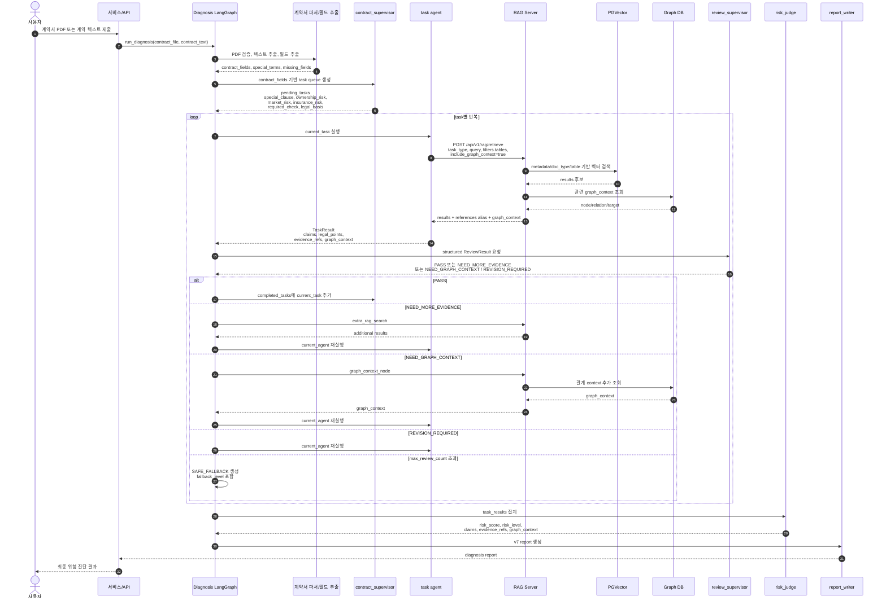
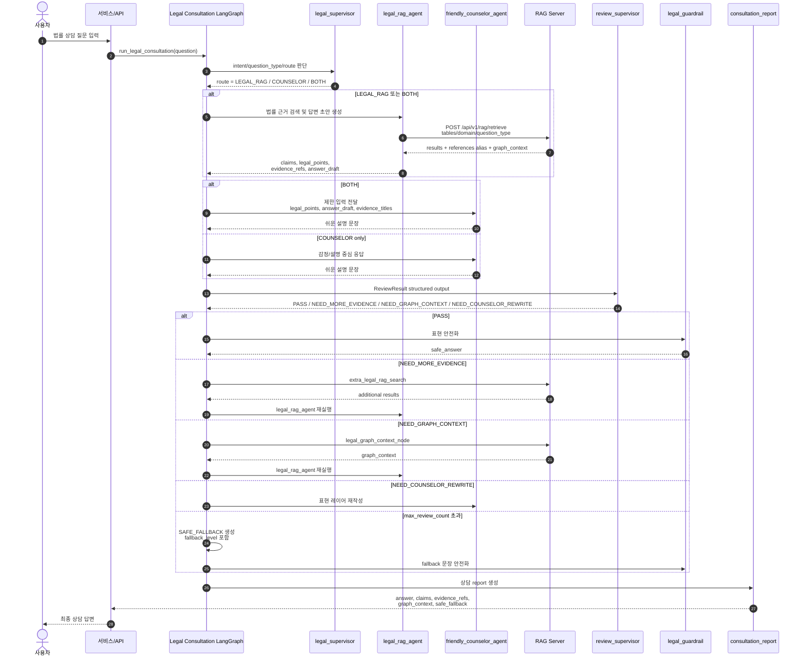
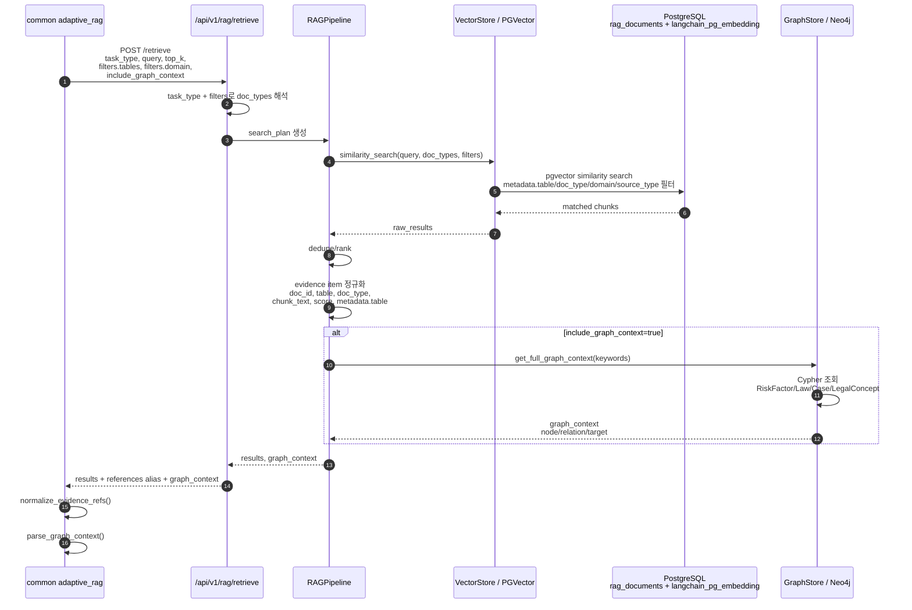
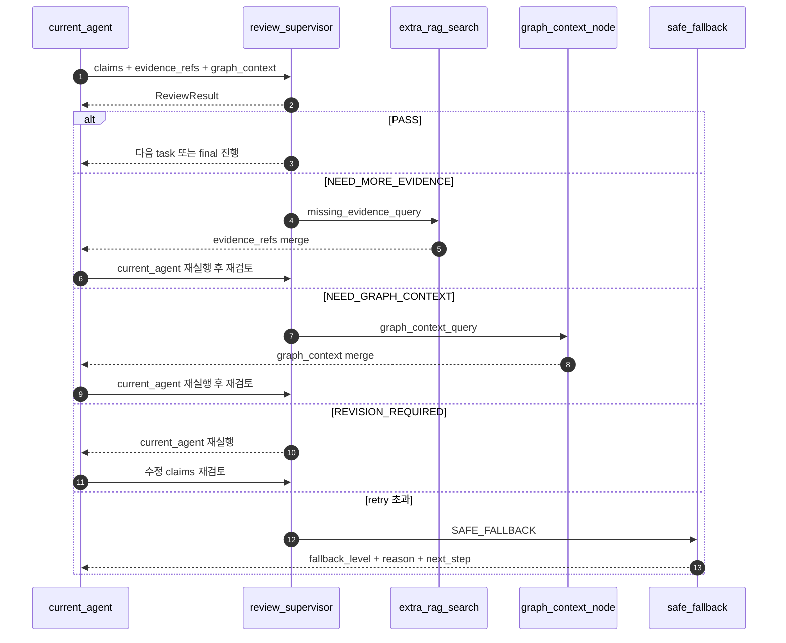

# v7 Common + RAG Sequence Diagrams

작성일: 2026-05-14

목적:
v7 설계, 수정된 `common`, RAG 백엔드가 어떤 순서로 동작하는지 설명하기 위한 시퀀스 다이어그램이다.

---

## 1. 전체 계약서 진단 흐름



핵심 설명:
- Supervisor가 먼저 task queue를 만든다.
- 각 task agent는 RAG에서 근거와 graph_context를 받아 claim을 만든다.
- Review Supervisor가 claim이 evidence 또는 graph_context에 연결되었는지 검증한다.
- 근거가 부족하면 바로 final로 가지 않고 `extra_rag_search -> current_agent 재실행 -> review`를 반복한다.
- Graph context가 필요하면 `graph_context_node -> current_agent 재실행 -> review`로 돌아간다.
- 최종 판단은 `risk_judge`, 출력은 `report_writer`가 담당한다.

### 1.1 계약서 진단 Agent별 판단 근거

| Agent | 어디서 실행 | 가져오는 문서/데이터 | 판단하는 내용 | 판단 결과 |
|---|---|---|---|---|
| `contract_intake` | Diagnosis Graph 초입 | 업로드 PDF 파일 자체 | 파일 존재 여부, PDF 유효성, 확장자, 기본 경고 | `analysis_ready`, `errors`, `missing_inputs` |
| `contract_parser` | PDF 검증 후 | PDF 텍스트, OCR 결과 | 계약서 본문, 조항 영역, 특약 영역 분리 | `contract_text`, `contract_sections` |
| `contract_field_extractor` | parser 후 | 계약서 본문/섹션 | 임대인, 임차인, 주소, 보증금, 월세, 계약기간, 특약 추출 | `contract_fields`, `field_validation` |
| `contract_supervisor` | 필드 추출 후 | `contract_fields`, 누락 필드 | 어떤 전문 Agent를 돌릴지 task queue 결정 | `pending_tasks`, `current_task`, `current_agent` |
| `special_clause_agent` | task loop | `special_clause_examples`, `contract_checklists`, `law_documents`, `case_documents`, `public_guides` | 특약이 표준계약/법령/사례 기준으로 임차인에게 불리한지 판단 | 특약 risk, 수정 권고, claims |
| `ownership_risk_agent` | task loop | `registry_guides`, `contract_checklists`, `law_documents`, `case_documents`, 등기 관련 graph_context | 임대인과 소유자 일치, 대리계약, 신탁/선순위 권리 위험 판단 | 권리관계 risk, 필요 서류, claims |
| `market_risk_agent` | task loop | `market_risk_guides`, `public_guides`, `case_documents`, 시세/깡통전세 관련 문서 | 보증금이 시세 대비 과도한지, 깡통전세 위험이 있는지 판단 | 시세 risk, 보증금 회수 위험 |
| `insurance_risk_agent` | task loop | `insurance_guides`, `public_guides`, `law_documents` | HUG/HF/SGI 보증보험 가입 가능성, 보증 제한 위험 판단 | 보험 risk, 확인 필요 항목 |
| `required_check_agent` | task loop | `contract_checklists`, `public_guides`, `registry_guides`, `insurance_guides` | 계약 전 반드시 확인해야 할 서류가 빠졌는지 판단 | 누락 서류, next_checks |
| `legal_basis_agent` | task loop 후반 | `law_documents`, `case_documents`, `public_guides`, `procedure_guides` | 앞선 Agent들의 판단을 법령/판례/절차 근거로 보강 | 법률 근거 claims |
| `review_supervisor` | 각 Agent 실행 후 | Agent의 `claims`, `evidence_refs`, `graph_context` | claim이 근거와 연결되는지, graph_context가 필요한지, 근거 부족 여부 판단 | `PASS`, `NEED_MORE_EVIDENCE`, `NEED_GRAPH_CONTEXT`, `REVISION_REQUIRED` |
| `extra_rag_search` | Review가 근거 부족 판단 시 | Review가 만든 `missing_evidence_query` 기반 추가 RAG 검색 | 기존 근거가 부족한 claim에 추가 문서 근거 확보 | 추가 `evidence_refs` |
| `graph_context_node` | Review가 관계 근거 부족 판단 시 | Neo4j `graph_context` | 법률 개념/위험요인/법령/사례 관계 근거 보강 | 추가 `graph_context` |
| `risk_judge` | 모든 task 후 | `task_results` 전체 | Agent별 risk와 claim을 합산해 최종 위험 점수/등급 판단 | `risk_score`, `risk_level` |
| `report_writer` | 마지막 | 전체 state, risk_judge 결과 | 사용자에게 보여줄 최종 보고서 구성 | `report` |

### 1.2 계약서 진단에서 RAG 문서가 쓰이는 방식

```text
Agent
→ task_type + query + filters.tables 생성
→ /api/v1/rag/retrieve 호출
→ RAG가 logical table에 맞는 문서 검색
→ results를 evidence_refs로 정규화
→ graph_context를 관계 근거로 병합
→ Agent가 claims와 legal_points 작성
→ Review Supervisor가 claims와 evidence_refs/graph_context 연결 여부 검증
```

예를 들어 `ownership_risk_agent`는 등기/권리관계 위험을 판단할 때:

```json
{
  "tables": [
    "registry_guides",
    "contract_checklists",
    "law_documents",
    "case_documents",
    "public_guides"
  ],
  "domain": [
    "registry",
    "senior_debt",
    "trust_registration",
    "tenant_protection"
  ],
  "include_graph_context": true
}
```

이 조건으로 문서를 가져오고, claim은 반드시 `evidence_ids` 또는 `graph_context_ids`와 연결되어야 한다.

---

## 2. 법률 상담 흐름



핵심 설명:
- `legal_supervisor`는 질문을 분류하고 RAG가 필요한지 결정한다.
- `legal_rag_agent`만 claims/evidence를 만든다.
- `friendly_counselor_agent`는 전체 state를 받지 않고 제한된 입력만 받아 쉬운 말로 바꾼다.
- `legal_guardrail`은 표현만 완화하며 claims/evidence/graph_context를 수정하지 않는다.

### 2.1 법률 상담 Agent별 판단 근거

| Agent | 어디서 실행 | 가져오는 문서/데이터 | 판단하는 내용 | 판단 결과 |
|---|---|---|---|---|
| `legal_supervisor` | 상담 그래프 초입 | 사용자 질문, 대화 이력 | 질문 유형과 route 판단. RAG가 필요한지, 단순 설명인지 결정 | `route`, `question_type`, `needs_rag` |
| `legal_rag_agent` | `LEGAL_RAG` 또는 `BOTH` route | `law_documents`, `case_documents`, `public_guides`, 질문 유형별 table | 법률적으로 확인 가능한 주장 생성. 답변 초안과 근거 생성 | `claims`, `legal_points`, `evidence_refs`, `answer_draft` |
| `friendly_counselor_agent` | `COUNSELOR` 또는 `BOTH` route | 제한 입력: `legal_points`, `answer_draft`, `evidence_titles` | 법률 판단을 새로 만들지 않고 쉬운 설명/공감/후속 안내로 표현 | 사용자 친화적 답변 문장 |
| `review_supervisor` | RAG 또는 counselor 후 | `claims`, `evidence_refs`, `graph_context`, `draft_answer` | 답변이 근거 기반인지, 추가 RAG/Graph가 필요한지 검증 | ReviewResult |
| `extra_legal_rag_search` | 근거 부족 시 | Review의 `missing_evidence_query` 기반 추가 RAG | 부족한 법령/판례/공공자료 근거 보강 | 추가 `evidence_refs` |
| `legal_graph_context_node` | 관계 근거 부족 시 | Neo4j graph_context | 법률 개념과 절차/위험요인 관계 보강 | 추가 `graph_context` |
| `legal_guardrail` | Review PASS 후 | 답변 초안, evidence_refs | 단정적 표현, 과도한 법률 판단 표현을 완화 | `safe_answer` |
| `safe_legal_fallback` | 반복 실패 시 | Review 실패 사유 | 확정 답변 대신 안전한 fallback 생성 | `SAFE_FALLBACK`, `fallback_level` |
| `consultation_report` | 마지막 | 전체 상담 state | 최종 상담 응답 패키징 | `report` |

### 2.2 질문 유형별 RAG 문서 선택

| question_type | 우선 검색 logical table | 판단 예시 |
|---|---|---|
| `DEPOSIT_RETURN` | `law_documents`, `case_documents`, `procedure_guides`, `public_guides` | 보증금 반환 지연, 내용증명, 임차권등기명령 |
| `REGISTRY_RISK` | `registry_guides`, `law_documents`, `case_documents`, `public_guides` | 근저당, 가압류, 신탁, 소유자 불일치 |
| `DEPOSIT_INSURANCE` | `insurance_guides`, `public_guides`, `law_documents` | HUG/HF/SGI 보증 가입 가능성 |
| `PROCEDURE_GUIDE` | `procedure_guides`, `public_guides`, `law_documents` | 내용증명, 지급명령, 임차권등기명령 절차 |
| `SIMPLE_EXPLANATION` | `faq_documents`, `public_guides` | 쉬운 설명, 기본 개념 안내 |

### 2.3 상담에서 판단 책임 분리

```text
legal_rag_agent
→ 법률 근거 검색
→ claims 생성
→ evidence_refs 연결

friendly_counselor_agent
→ claims 생성 금지
→ evidence_refs 수정 금지
→ 쉬운 설명만 담당

legal_guardrail
→ claims/evidence/graph_context 수정 금지
→ 표현 안전화만 담당
```

---

## 3. RAG 서버 내부 흐름



핵심 설명:
- `results`가 v7 표준이다.
- `references`는 기존 코드 호환용 alias다.
- 물리 DB가 단일 `rag_documents`여도 `metadata.table`로 logical table을 보존한다.
- Graph DB는 RAG 검색 결과와 별도로 관계 근거를 `graph_context`로 제공한다.

### 3.1 RAG 서버가 문서를 고르는 방식

RAG 서버는 Agent가 넘긴 `task_type`과 `filters`를 함께 사용한다.

```json
{
  "task_type": "legal_basis",
  "query": "전입신고와 대항력 관계",
  "filters": {
    "tables": ["law_documents", "case_documents"],
    "domain": ["tenant_protection"],
    "source_type": ["law", "case"],
    "include_graph_context": true
  }
}
```

검색 우선순위:

1. `filters.tables`를 logical table로 해석한다.
2. logical table을 `doc_type` 또는 `metadata.table` 필터로 바꾼다.
3. `domain`, `source_type`, `authority_level`이 있으면 함께 필터링한다.
4. pgvector similarity search로 유사도가 높은 chunk를 찾는다.
5. score 기준으로 정렬하고 중복을 제거한다.
6. 각 chunk를 v7 `results` item으로 정규화한다.

### 3.2 RAG result item이 판단 근거가 되는 방식

각 result는 단순 텍스트가 아니라 claim 검증용 evidence다.

```json
{
  "doc_id": "law-001-3",
  "title": "주택임대차보호법 제3조",
  "table": "law_documents",
  "doc_type": "law",
  "source_type": "law",
  "domain": ["tenant_protection"],
  "authority_level": "official",
  "chunk_text": "대항력 관련 조문 내용",
  "score": 0.87,
  "metadata": {
    "table": "law_documents",
    "chunk_index": 3
  }
}
```

Agent는 이 result의 `doc_id`를 claim의 `evidence_ids`에 연결한다.

```json
{
  "claim_id": "registry_risk_claim_1",
  "text": "임차인이 대항력을 갖추려면 전입신고 등 요건 확인이 필요하다.",
  "evidence_ids": ["law-001-3"],
  "graph_context_ids": ["대항력|requires|전입신고"]
}
```

이 연결이 없으면 Review Supervisor는 PASS시키지 않는다.

---

## 4. Review Loop 핵심 흐름



핵심 설명:
- 추가 근거만 붙이고 final로 가지 않는다.
- 반드시 현재 agent가 새 근거를 반영해서 claims를 다시 작성한다.
- Review Supervisor는 structured output을 반환해야 라우팅이 안정적으로 동작한다.

### 4.1 Review Supervisor가 보는 판단 기준

Review Supervisor는 문장을 예쁘게 보는 Agent가 아니라 검증 라우터다.

| 검증 항목 | 확인하는 데이터 | 실패 시 route |
|---|---|---|
| claim이 있는가 | `claims` | `REVISION_REQUIRED` 또는 fallback |
| claim이 문서 근거와 연결되는가 | `claim.evidence_ids`, `evidence_refs.doc_id` | `NEED_MORE_EVIDENCE` 또는 `REVISION_REQUIRED` |
| 관계 검증이 필요한가 | `current_task`, `current_agent` | `NEED_GRAPH_CONTEXT` |
| graph_context가 존재하는가 | `graph_context` | `NEED_GRAPH_CONTEXT` |
| 답변 초안이 근거와 충돌하지 않는가 | `draft_answer`, `evidence_refs` | `REVISION_REQUIRED` |
| 반복 횟수를 넘었는가 | `review_count`, `max_review_count` | `SAFE_FALLBACK` |

### 4.2 Review 이후 재실행이 필요한 이유

```text
잘못된 흐름:
추가 RAG 검색
→ 근거만 state에 붙임
→ final

v7 흐름:
추가 RAG 검색
→ current_agent 재실행
→ 새 evidence를 반영해 claims 재작성
→ review 재검증
```

이렇게 해야 최종 report의 claim이 실제 추가 근거를 반영한다.

---

## 5. 질문 대응용 짧은 설명

질문: RAG와 Graph DB는 어디서 쓰이나?

답변:
RAG는 각 agent가 claims를 만들 때 필요한 문서 근거를 `results/evidence_refs`로 제공한다. Graph DB는 법률 개념, 위험 요인, 절차, 법령, 사례 사이의 관계를 `graph_context`로 제공한다. Review Supervisor는 claims가 evidence 또는 graph_context에 연결되어 있는지 검증한다.

질문: 왜 `results`와 `references`가 둘 다 있나?

답변:
v7 표준은 `results`다. 다만 기존 구현이 `references`를 사용하고 있어서 초기 마이그레이션 동안 `references`를 alias로 유지한다. 내부 state에서는 `evidence_refs`로 정규화한다.

질문: 왜 RAG 테이블을 10개로 안 나누나?

답변:
물리 테이블은 단일 `rag_documents`여도 된다. 대신 `metadata.table`에 `law_documents`, `case_documents`, `public_guides` 같은 logical table 값을 보존한다. 이렇게 하면 운영은 단순하고 agent 설계상 필요한 출처 구분도 유지된다.

질문: 근거가 부족하면 어떻게 되나?

답변:
Review Supervisor가 `NEED_MORE_EVIDENCE`를 반환한다. 그러면 `extra_rag_search`가 추가 근거를 찾고, 현재 agent가 그 근거를 반영해 다시 claims를 작성한 뒤 재검토한다.

질문: Graph DB가 없으면 어떻게 되나?

답변:
`graph_context`가 필요한 task에서 비어 있으면 Review Supervisor가 `NEED_GRAPH_CONTEXT` 또는 fallback으로 보낸다. 반복 후에도 확보되지 않으면 `SAFE_FALLBACK`으로 내려가고 `fallback_level`과 이유를 report에 남긴다.
