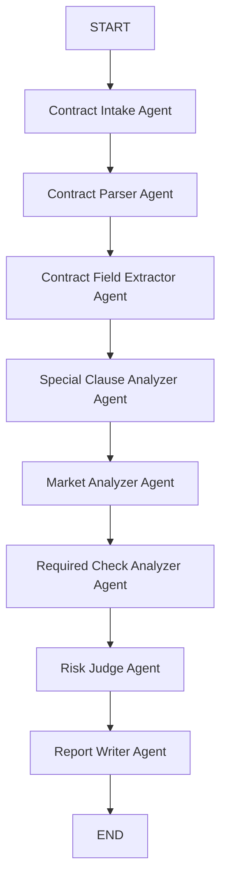
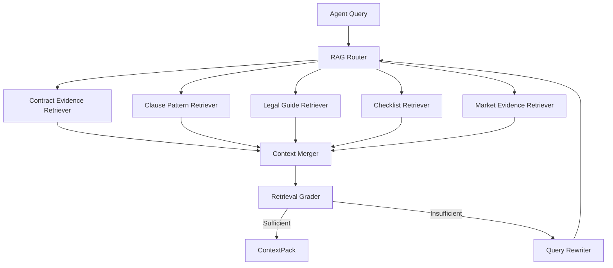
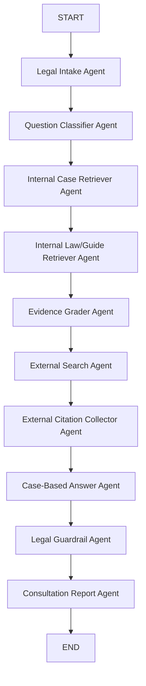
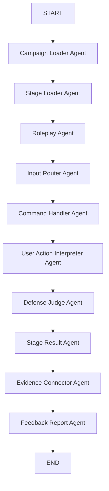
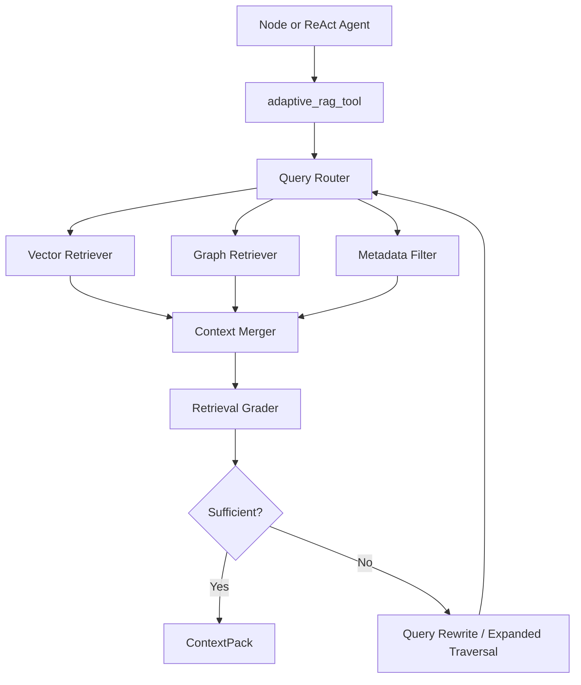

# 전세계약 진단 LangGraph / Multi-Agent 설계

## 1. 담당 범위

이 모듈은 RAG 내부 검색 로직을 직접 구현하지 않고, 전세계약 진단을 위한 LangGraph 기반 멀티 에이전트 실행 흐름을 담당한다.

- 입력: 전세계약서 1개(PDF/TXT, OCR은 추후 확장)
- 출력: 위험 점수, 위험 등급, 위험 요인, 시세 분석, 추가 확인 체크리스트, RAG 근거 요약
- RAG 연결: `common.tools.adaptive_rag.adaptive_rag()` 인터페이스를 호출한다.
- 법률자문 AI 상담사 그래프는 후순위 확장으로 분리한다.

## 2. 전체 그래프



## 3. 에이전트 목록

| Agent | 역할 | 가져오는 데이터 | 타입 | LLM 사용 |
| --- | --- | --- | --- | --- |
| Contract Intake Agent | 계약서 입력 존재 여부와 파일 형식 확인 | 사용자 업로드 계약서 경로 | Validation Agent | X |
| Contract Parser Agent | PDF/TXT에서 계약서 텍스트 추출 | 계약서 파일 | Tool Agent | X |
| Contract Field Extractor Agent | 임대인, 임차인, 주소, 보증금, 주택유형, 특약 구조화 | 계약서 텍스트 | Extraction Agent | O, 실패 시 regex fallback |
| Special Clause Analyzer Agent | 위험 특약과 빠진 방어 특약 탐지 | 계약서 특약 + RAG context | RAG-using Analysis Agent | 규칙 중심, 추후 LLM 확장 |
| Market Analyzer Agent | 전세/매매 CSV로 전세가율과 보증금 위치 분석 | `data/*.csv` | Structured Data Tool Agent | X |
| Required Check Analyzer Agent | 계약서만으로 확인 불가능한 필수 위험 항목 생성 | 체크리스트 RAG context | RAG-using Checklist Agent | X |
| Risk Judge Agent | 모든 finding을 합산해 위험 점수/등급 산정 | 앞선 agent 결과 | Rule Judge Agent | X |
| Report Writer Agent | 사용자 리포트 생성 | 전체 state + RAG 근거 | Report Agent | 현재 규칙 기반, 추후 LLM 요약 가능 |

## 4. RAG 연결 방식

Multi-Agent 파트는 RAG 내부 구현을 몰라도 되도록 다음 함수만 사용한다.

```python
adaptive_rag(
    task_type: str,
    query: str,
    filters: dict,
    top_k: int,
) -> ContextPack
```

RAG 담당자가 나중에 내부를 다음 구조로 교체할 수 있다.



## 5. 현재 데이터 연결

| 데이터 | 파일 | 사용 Agent | 용도 |
| --- | --- | --- | --- |
| 전세 실거래가 | `data/2025_전세_종로구_통합_cleaned.csv` | Market Analyzer | 주변 전세 보증금 중앙값, 보증금 percentile 계산 |
| 연립다세대 매매 | `data/fixed_연립다세대(매매)_실거래가_20260507195717.csv` | Market Analyzer | 추정 매매가 및 전세가율 계산 |
| 오피스텔 매매 | `data/fixed_오피스텔(매매)_실거래가_20260507195801.csv` | Market Analyzer | 추정 매매가 및 전세가율 계산 |
| 법령/사례/체크리스트 PDF | `docs/pdf/pdf/**` | RAG 인터페이스 | 특약 판단, 추가 확인 항목, 리포트 근거 |

## 6. 계약서만 입력받는 MVP에서 중요한 한계

계약서만으로는 다음 항목을 확정할 수 없다. 따라서 이 시스템은 해당 항목을 “위험 확정”이 아니라 “추가 확인 필요”로 표시한다.

- 등기부 갑구/을구 권리관계
- 임대인과 등기부 소유자 일치 여부
- 선순위 임차인 및 선순위 보증금
- 국세/지방세 체납
- 신탁 등기 여부
- 위반건축물 여부

## 7. 실행 예시

```powershell
$env:ENABLE_LLM='0'
python -m common.graphs.diagnosis_graph
```

Ollama를 사용할 경우 기본값은 다음과 같다.

- `OLLAMA_BASE_URL=http://localhost:11434`
- `OLLAMA_MODEL=gemma4:e2b`

## 8. 후속 수정 필요 항목

### 8.1 실제 계약서 파싱 실패 처리 개선

현재 MVP 테스트 편의를 위해 계약서 파일 경로가 없거나 PDF 파싱에 실패하면 mock 계약서 텍스트로 대체될 수 있다. 이 동작은 구조 검증용으로만 허용한다.

실서비스 또는 팀 통합 단계에서는 다음과 같이 수정해야 한다.

- 파일 경로가 없는 데모 실행에서만 mock 계약서를 사용한다.
- 사용자가 실제 계약서 파일을 업로드했는데 파일이 없거나 파싱에 실패하면 mock으로 대체하지 않고 오류 상태를 반환한다.
- OCR이 연결되기 전까지 JPG, PNG 같은 이미지 계약서는 입력 허용 목록에서 제외하거나, 명확히 "OCR 미지원" 오류를 반환한다.
- OCR/RAG 연동 이후에는 추출 실패 사유와 신뢰도를 state에 기록한다.

이 항목은 `Contract Intake Agent`, `Contract Parser Agent`, OCR 도구, RAG 문서화 로직이 연결될 때 함께 수정한다.

### 8.2 특약 분석 고도화

현재 `Special Clause Analyzer Agent`는 MVP 구조 검증을 위해 일부 키워드 기반 규칙으로 위험 특약을 탐지한다. 실제 전세사기 위험 진단 품질을 높이려면 RAG 연동 후 다음 방식으로 개선한다.

- 전세사기 예방 체크리스트, 표준계약서, 법령/가이드, 사례집에서 위험 특약 패턴을 검색한다.
- 검색된 근거 context를 기준으로 특약을 유형화한다.
- 임차인에게 불리한 조항, 빠진 방어 특약, 수정 권장 문구를 분리해서 반환한다.
- 단순 키워드 매칭이 아니라 조항의 의미를 LLM/structured output으로 판정한다.
- 최종 위험 점수는 LLM이 아니라 `Risk Judge Agent`의 규칙 기반 산정으로 유지한다.

이 항목은 RAG 담당자가 `adaptive_rag()` 내부를 실제 Adaptive/Corrective RAG로 교체한 뒤 확장한다.

## 9. 현재 Common 폴더 구조

진단 그래프와 향후 법률 정보 상담 그래프를 분리하기 위해 `common` 폴더를 graph별 구조로 정리한다.

```text
common/
  agents/
    diagnosis_nodes.py              # 전세계약 진단 그래프의 agent node
    legal_consultation_nodes.py     # 추후 법률 정보 상담 그래프 node 예정

  graphs/
    diagnosis_graph.py              # 전세계약 진단 LangGraph
    legal_consultation_graph.py     # 추후 법률 정보 상담 LangGraph 예정

  schemas/
    shared.py                       # ContextPack, RiskFinding, AgentTrace 등 공용 schema
    diagnosis.py                    # DiagnosisState, MarketAnalysis 등 진단 전용 schema
    legal_consultation.py           # 추후 법률 상담 전용 schema 예정

  tools/
    adaptive_rag.py                 # RAG 팀이 교체할 RAG boundary
    document.py                     # 계약서 PDF/TXT 파싱 및 필드 추출
    market.py                       # 전세/매매 CSV 기반 시세 분석
    llm.py                          # Ollama local LLM client
    external_search.py              # 추후 외부 검색 tool 예정
```

현재 구현된 파일은 진단 그래프 중심이며, 법률 정보 상담 그래프 파일은 다음 작업에서 추가한다.

## 10. 법률 정보 상담 그래프 설계 및 구현

법률 정보 상담 그래프는 전세계약 진단 그래프와 분리된 별도 LangGraph이다. 사용자가 특약, 보증금 반환, 대항력, 등기 위험 등에 대해 질문하면 내부 판례/법령 RAG를 우선 검색하고, 내부 근거가 부족할 경우 외부 공신력 자료를 함께 참고한다.

### 10.1 설계 원칙

- 내부 판례 RAG를 최우선으로 사용한다.
- 내부 판례가 부족하면 내부 법령, 가이드, 체크리스트를 함께 사용한다.
- 내부 근거가 불충분하면 외부 공신력 자료를 사용하고, 답변에 외부 자료 사용 사실을 명시한다.
- 답변은 판례와 법령 근거를 중심으로 작성한다.
- `승소 가능합니다`, `무조건 이깁니다` 같은 단정적 법률 자문 표현은 금지한다.
- 최종 답변에는 법률 자문이 아니라 정보 제공이라는 고지를 포함한다.

### 10.2 그래프 흐름



현재 MVP에서는 `External Search Agent`가 내부 근거가 충분하면 검색을 건너뛰고, 내부 근거가 부족하다고 판단되면 외부 공신력 자료 후보를 반환한다. 실제 웹 검색 API는 `common/tools/external_search.py` 내부를 교체해 연결한다.

### 10.3 구현 파일

```text
common/schemas/legal_consultation.py
common/nodes/legal_consultation_nodes.py
common/graphs/legal_consultation_graph.py
common/tools/external_search.py
```

### 10.4 출력 구조

```json
{
  "answer": "판례/법령 근거 기반 최종 답변",
  "basis_type": "INTERNAL_CASE | INTERNAL_LAW | EXTERNAL_SOURCE | MIXED | INSUFFICIENT",
  "used_external_search": false,
  "confidence": "HIGH | MEDIUM | LOW",
  "question_type": "DEPOSIT_RETURN",
  "cited_cases": [],
  "cited_laws": [],
  "external_sources": [],
  "recommended_actions": [],
  "disclaimer": "본 답변은 법률 자문이 아니라 판례와 공공자료 기반 정보 제공입니다.",
  "agent_trace": []
}
```

### 10.5 실행 예시

```powershell
$env:ENABLE_LLM='0'
python -m common.graphs.legal_consultation_graph
```

Ollama를 사용할 경우:

```powershell
$env:ENABLE_LLM='1'
$env:OLLAMA_MODEL='gemma4:e4b'
python -m common.graphs.legal_consultation_graph
```

### 10.6 RAG 연동 시 교체 지점

현재 내부 판례/법령 검색은 `common/tools/adaptive_rag.py`의 mock context를 사용한다. RAG 팀이 실제 retriever를 연결할 때는 다음 task type을 구현하면 된다.

- `legal_case_search`: 내부 판례/판결문 검색
- `legal_law_guide_search`: 법령, 가이드, 사례집, 체크리스트 검색

외부 자료 검색은 `common/tools/external_search.py`의 `search_external_sources()`를 실제 검색 API 또는 공공기관 검색 모듈로 교체한다.

## 11. 외부 검색 API 연결 설정

법률 정보 상담 그래프의 외부 검색은 `common/tools/external_search.py`에서 관리한다. 그래프 노드는 `search_external_sources()`만 호출하므로, 외부 검색 API를 바꾸더라도 LangGraph 노드는 수정하지 않는다.

### 11.1 Provider 선택

환경변수 `EXTERNAL_SEARCH_PROVIDER`로 provider를 선택한다.

```powershell
$env:EXTERNAL_SEARCH_PROVIDER='mock'
$env:EXTERNAL_SEARCH_PROVIDER='naver'
$env:EXTERNAL_SEARCH_PROVIDER='serpapi'
$env:EXTERNAL_SEARCH_PROVIDER='custom'
```

### 11.2 Mock Provider

API 키 없이 동작하는 기본값이다. 실제 인터넷 검색은 하지 않고 공신력 있는 외부 자료 후보를 반환한다.

```powershell
$env:EXTERNAL_SEARCH_PROVIDER='mock'
```

반환 후보:

- 국가법령정보센터
- 대한법률구조공단
- 주택임대차분쟁조정위원회

### 11.3 Naver Search API Provider

Naver Search API를 사용할 경우 다음 환경변수를 설정한다.

```powershell
$env:EXTERNAL_SEARCH_PROVIDER='naver'
$env:NAVER_CLIENT_ID='발급받은-client-id'
$env:NAVER_CLIENT_SECRET='발급받은-client-secret'
```

API 키가 없거나 호출에 실패하면 mock provider 결과로 fallback한다.

### 11.4 SerpAPI Provider

Google 검색 결과가 필요하면 SerpAPI를 사용할 수 있다.

```powershell
$env:EXTERNAL_SEARCH_PROVIDER='serpapi'
$env:SERPAPI_API_KEY='발급받은-api-key'
```

### 11.5 Custom Provider

팀에서 별도 검색 API 서버를 만들 경우 다음 형식으로 연결한다.

```powershell
$env:EXTERNAL_SEARCH_PROVIDER='custom'
$env:EXTERNAL_SEARCH_ENDPOINT='https://example.com/search'
```

`custom` endpoint는 다음 query parameter를 받는다고 가정한다.

```text
q: 검색어
question_type: 질문 유형
limit: 결과 개수
```

응답은 `results` 또는 `items` 배열을 포함하면 된다.

```json
{
  "results": [
    {
      "title": "자료 제목",
      "publisher": "기관명",
      "url": "https://...",
      "summary": "핵심 요약"
    }
  ]
}
```

### 11.6 외부 검색 사용 표시

내부 RAG 근거가 부족해서 외부 검색을 사용하면 최종 리포트에 다음 값이 표시된다.

```json
{
  "used_external_search": true,
  "basis_type": "EXTERNAL_SOURCE",
  "external_sources": []
}
```

답변 본문에도 “내부 자료에서 충분한 근거를 찾지 못해 외부 공신력 자료를 함께 참고했습니다.”라는 문장이 추가된다.

## 12. Mock / 실제 구현 / 후속 교체 목록

오늘 구현한 그래프는 전세계약 진단 그래프와 법률 정보 상담 그래프 2개이다. 두 그래프 모두 LangGraph 흐름과 Agent trace는 실제로 동작한다. 다만 RAG 팀 연동 전까지 일부 검색 결과는 mock context를 사용한다.

### 12.1 실제 구현 완료

| 영역 | 상태 | 설명 |
| --- | --- | --- |
| LangGraph 실행 | 실제 구현 | `diagnosis_graph.py`, `legal_consultation_graph.py` 모두 실제 LangGraph로 실행됨 |
| Agent trace | 실제 구현 | 각 Agent 실행 순서와 입출력 요약이 report에 기록됨 |
| Ollama LLM 연동 | 실제 구현 | `gemma4:e2b` 사용 가능, `ENABLE_LLM`으로 on/off 제어 |
| PDF/TXT 계약서 파싱 | 실제 구현 | 텍스트 PDF/TXT 파싱 가능, 한글 PDF는 PyMuPDF fallback 포함 |
| 계약서 필드 추출 | 실제 구현 | LLM 사용, 실패 시 regex fallback |
| CSV 시세 분석 | 실제 구현 | `data/*.csv` 기반 전세/매매 비교 및 전세가율 추정 |
| 위험도 산정 | 실제 구현 | `Risk Judge Agent`가 rule 기반으로 점수/등급 산정 |
| 법률 상담 guardrail | 실제 구현 | 단정적 법률 자문 표현을 완화하고 disclaimer 추가 |
| 외부 API provider 구조 | 실제 구현 | `mock`, `naver`, `serpapi`, `custom` provider 선택 구조 구현 |

### 12.2 Mock 상태인 부분

| 영역 | 파일 | 현재 상태 | 후속 교체 방식 |
| --- | --- | --- | --- |
| 특약 분석 RAG | `common/tools/adaptive_rag.py` | `mock-checklist-special-clause` 반환 | 실제 체크리스트/가이드/법령 RAG retriever 연결 |
| 추가 확인 항목 RAG | `common/tools/adaptive_rag.py` | `mock-checklist-required-docs` 반환 | 실제 전세사기 체크리스트/가이드 검색 연결 |
| 리포트 근거 RAG | `common/tools/adaptive_rag.py` | `mock-guide-report` 반환 | 실제 근거 문서 chunk 출처 연결 |
| 법률 상담 판례 RAG | `common/tools/adaptive_rag.py` | `RAG_CASE_SAMPLE` 반환 | 실제 판례 DB/vector retriever 연결 |
| 법률 상담 법령 RAG | `common/tools/adaptive_rag.py` | `mock-law-housing-lease` 반환 | 실제 법령/가이드 retriever 연결 |
| 외부 검색 fallback | `common/tools/external_search.py` | API 키 없으면 공공기관 후보 mock 반환 | Naver/SerpAPI/custom API key 설정 후 실제 검색 사용 |
| 파일 없는 진단 실행 | `common/tools/document.py` | `contract_file=None`이면 `MOCK_CONTRACT_TEXT` 사용 | 실서비스에서는 실제 업로드 파일 필수로 변경 |

### 12.3 아직 미구현 또는 후속 과제

| 항목 | 상태 | 메모 |
| --- | --- | --- |
| OCR | 미구현 | 스캔 PDF, JPG, PNG 계약서 분석은 OCR 연결 후 가능 |
| 실제 판례번호/법원명 인용 | RAG 연동 필요 | 현재는 `RAG_CASE_SAMPLE`, 실제 판례 메타데이터 연결 필요 |
| 외부 API 실호출 | 키 설정 필요 | provider 구조는 구현됨. API key/env 설정 후 실호출 가능 |
| RAG 근거 충분성 고도화 | 후속 개선 | 현재는 context 개수 기반. 실제로는 relevance score/metadata 기반 grading 필요 |
| 특약 의미 기반 분석 | 후속 개선 | 현재는 일부 rule 기반. RAG+LLM structured output으로 고도화 예정 |
| 실제 파일 파싱 실패 처리 | 후속 개선 | 현재 일부 경우 mock fallback 가능. 실서비스에서는 error state 반환 필요 |

### 12.4 그래프별 상태 요약

#### 전세계약 진단 그래프

실제 동작:

- PDF/TXT 계약서 파싱
- LLM/regex 필드 추출
- 특약 rule 분석
- CSV 시세 분석
- 계약서만으로 확인 불가능한 항목 생성
- 위험도 산정
- 리포트 생성

Mock/후속 연결:

- 특약 판단 근거 RAG
- 체크리스트/법령/가이드 근거 RAG
- OCR
- 실제 파일 파싱 실패 정책

#### 법률 정보 상담 그래프

실제 동작:

- 질문 분류
- 내부 판례/법령 RAG 호출 흐름
- Evidence grading
- 내부 근거 부족 시 외부 검색 fallback 흐름
- LLM 답변 생성
- 법률 자문 guardrail
- 출처/근거/report 패키징

Mock/후속 연결:

- 내부 판례 RAG 결과
- 내부 법령/가이드 RAG 결과
- 외부 검색 API key 기반 실검색

### 12.5 외부 API 사용 방법 요약

API 키 없이 실행하면 mock fallback이 동작한다.

```powershell
$env:EXTERNAL_SEARCH_PROVIDER='mock'
```

Naver Search API를 사용할 경우:

```powershell
$env:EXTERNAL_SEARCH_PROVIDER='naver'
$env:NAVER_CLIENT_ID='발급받은-client-id'
$env:NAVER_CLIENT_SECRET='발급받은-client-secret'
```

SerpAPI를 사용할 경우:

```powershell
$env:EXTERNAL_SEARCH_PROVIDER='serpapi'
$env:SERPAPI_API_KEY='발급받은-api-key'
```

팀 자체 검색 API를 사용할 경우:

```powershell
$env:EXTERNAL_SEARCH_PROVIDER='custom'
$env:EXTERNAL_SEARCH_ENDPOINT='https://example.com/search'
```

## 13. Interactive 테스트 실행 방법

PowerShell에서 긴 `python -c` 명령을 직접 입력하면 따옴표가 꼬이기 쉽다. 그래서 두 그래프 모두 `python -m ...` 실행 후 값을 입력하는 interactive mode를 지원한다.

### 13.1 전세계약 진단 그래프

```powershell
cd "C:\Users\Playdata\Desktop\SKN27-3rd-4TEAM"
.\.venv\Scripts\activate
$env:ENABLE_LLM='0'
python -m common.graphs.diagnosis_graph
```

실행 후 계약서 파일 경로를 입력한다. 비워두고 Enter를 누르면 mock 계약서로 실행된다.

```text
[전세계약 진단 그래프]
계약서 PDF/TXT 경로를 입력하세요. 비워두면 mock 계약서로 실행합니다.
> C:\tmp\jeonse_contract_sample_cjk.pdf
```

### 13.2 법률 정보 상담 그래프

```powershell
cd "C:\Users\Playdata\Desktop\SKN27-3rd-4TEAM"
.\.venv\Scripts\activate
$env:ENABLE_LLM='1'
$env:OLLAMA_MODEL='gemma4:e2b'
python -m common.graphs.legal_consultation_graph
```

실행 후 질문과 관련 특약/계약 문맥을 입력한다. 비워두고 Enter를 누르면 기본 예시로 실행된다.

```text
[법률 정보 상담 그래프]
질문을 입력하세요. 비워두면 기본 예시 질문으로 실행합니다.
> 다음 임차인이 들어와야 보증금을 돌려준다는 특약이 괜찮나요?

관련 특약/계약 문맥을 입력하세요. 비워두면 기본 예시 특약을 사용합니다.
> 보증금 반환은 다음 임차인 입주 이후에 한다.
```

빠른 테스트가 목적이면 LLM을 끄고 실행할 수 있다.

```powershell
$env:ENABLE_LLM='0'
python -m common.graphs.legal_consultation_graph
```

## 14. RAG 연동 후 하드코딩 제거 필수 항목

현재 일부 Agent에는 MVP 구조 검증을 위한 하드코딩 rule이 남아 있다. 이 rule들은 최종 판단 로직이 아니라 RAG 연결 전 임시 fallback이다. RAG 팀의 실제 retriever가 연결되면 문서 기반 판단으로 최대한 교체한다.

### 14.1 반드시 교체할 하드코딩 영역

| 영역 | 현재 방식 | 교체 방향 |
| --- | --- | --- |
| 특약 위험 판단 | `diagnosis_nodes.py`의 `risky_patterns` 키워드 rule | `adaptive_rag("special_clause_analysis")` 결과 + LLM structured output 기반 판단 |
| 빠진 방어 특약 판단 | `잔금`, `권리변동` 문자열 포함 여부 검사 | 체크리스트/표준계약서/사례집 RAG 근거 기반으로 필요한 방어 특약 판단 |
| 특약 수정 권장 문구 | 코드에 고정된 권장 문장 | RAG 근거와 특약 유형별 template/LLM structured output으로 생성 |
| 법률 상담 판례 근거 | `RAG_CASE_SAMPLE` mock 판례 | 실제 판례 chunk, 법원명, 사건번호, 판결요지 metadata 사용 |
| 법률 상담 법령 근거 | `mock-law-housing-lease` | 실제 법령/가이드 문서 chunk와 출처 metadata 사용 |
| Evidence grading | context 개수 중심 판단 | relevance score, doc_type, metadata, chunk 내용 기반 grading |

### 14.2 목표 구조

RAG 연동 후 특약 분석은 다음 흐름으로 변경한다.

```text
계약서 특약
→ adaptive_rag("special_clause_analysis")
→ 체크리스트/표준계약서/법령/사례집/판례 context 검색
→ LLM structured output으로 위험 유형, 근거, 수정 권장 문구 추출
→ Risk Judge Agent가 점수만 rule 기반으로 합산
```

LLM/RAG가 담당하는 것:

- 어떤 특약이 위험한지 판단
- 어떤 문서 근거를 참고했는지 연결
- 위험 사유 설명
- 빠진 방어 특약 탐지
- 수정 권장 문구 생성

Rule 코드가 계속 담당하는 것:

- finding 점수 합산
- 위험 등급 산정
- 최종 리포트 포맷팅
- 법률 자문 guardrail

### 14.3 구현 시 주의사항

- 하드코딩 rule은 완전히 삭제하기보다 `RAG 결과가 비었을 때만 사용하는 fallback`으로 낮춘다.
- 최종 리포트에는 RAG source id, 문서 제목, chunk metadata를 함께 남긴다.
- 판례 인용은 `법원명`, `사건번호`, `쟁점`, `판결요지`, `사용자 질문과의 관련성`을 구조화해서 반환한다.
- 위험 점수 자체는 LLM이 직접 정하지 않고, `Risk Judge Agent`가 deterministic rule로 산정한다.
- 외부 검색 결과를 사용한 경우 `used_external_search=true`와 외부 출처 URL을 반드시 표시한다.

### 14.4 완료 기준

다음 조건을 만족하면 하드코딩 제거 작업이 완료된 것으로 본다.

- `risky_patterns`가 메인 판단 경로에서 제거되고 fallback으로만 사용된다.
- `special_clause_analysis`가 실제 RAG 문서 chunk를 반환한다.
- 특약 finding에 RAG 근거 source id가 포함된다.
- 법률 상담 답변의 `RAG_CASE_SAMPLE`이 실제 판례번호/법원명으로 대체된다.
- 외부 자료 사용 여부가 report에 명확히 표시된다.

## 15. 전세사기 방어 시뮬레이션 그래프 설계

전세사기 방어 시뮬레이션 그래프는 사용자가 실제 전세피해 사례 기반 상황을 직접 방어해보는 훈련 모드이다. 기존 전세계약 진단 그래프와 법률 정보 상담 그래프와 분리된 세 번째 LangGraph로 구현한다.

### 15.1 목적

- 경기도 전세피해 사례집의 사례를 시나리오 seed로 활용한다.
- 전세사기 피해예방 종합안내서의 체크리스트를 방어 행동/채점 기준으로 활용한다.
- 전세피해법률상담사례집과 법률 정보 상담 그래프를 피드백 근거로 활용한다.
- 사용자는 임차인 역할로 질문, 확인 요청, 특약 수정 요구 등을 입력한다.
- AI는 위험 요소를 축소하거나 계약을 빠르게 진행하려는 임대인/중개인 역할을 연기한다.

### 15.2 MVP 진행 방식

MVP에서는 한 번의 그래프 실행이 현재 stage 하나를 처리한다.

```text
카테고리 선택
→ 현재 stage 로드
→ AI 임대인/중개인 메시지 생성
→ 사용자 대응 입력
→ 대응 평가
→ stage 결과 및 next_stage_index 반환
```

프론트 또는 CLI는 `next_stage_index`를 다음 요청에 넘겨 캠페인을 이어간다.

### 15.3 그래프 구조



MVP에서는 조건부 edge를 복잡하게 쓰기보다, `input_type`이 command이면 `User Action Interpreter Agent`와 `Defense Judge Agent`가 skip되도록 구현한다.

### 15.4 Agent 역할

| Agent | 역할 |
| --- | --- |
| Campaign Loader Agent | 선택한 카테고리와 전체 stage 목록 로드 |
| Stage Loader Agent | 현재 stage 정보, 숨겨진 위험, 필수 방어 행동 로드 |
| Roleplay Agent | 임대인/중개인 역할로 위험 상황 메시지 생성 |
| Input Router Agent | 사용자 입력이 명령어인지 방어 행동인지 분류 |
| Command Handler Agent | `/힌트`, `/상태`, `/근거`, `/도움말`, `/포기` 처리 |
| User Action Interpreter Agent | 사용자 발화를 방어 행동으로 해석 |
| Defense Judge Agent | 필수 방어 행동 충족 여부 평가 |
| Stage Result Agent | 통과/실패/게임오버/다음 stage 여부 결정 |
| Evidence Connector Agent | 법률 정보 상담 그래프 또는 RAG 근거 연결 |
| Feedback Report Agent | 점수, 잘한 점, 놓친 점, 다음 행동, 근거를 리포트로 패키징 |

### 15.5 카테고리

MVP는 5개 카테고리, 각 카테고리 2개 stage를 기본 seed로 구성한다.

| 카테고리 | 포함 사례 예시 |
| --- | --- |
| 권리관계 은폐형 | 신탁등기 악용, 위조된 등기부등본, 임차권등기, 법정기일 확인 |
| 명의/대리인 사기형 | 동명이인 계약, 대리권 없는 자와의 계약, 공인중개사 공모 |
| 보증금 회수 위험형 | 무자본 갭투자, 깡통전세, 다가구 선순위 보증금 |
| 대항력/우선변제권 허점형 | 대항력 발생시기, 전입신고 미이행, 주민등록 이전 |
| 불리한 계약/특약 유도형 | 보증금 반환 지연 특약, 특약이 절대적이지 않은 이유 |

### 15.6 명령어 시스템

사용자는 일반 대응 외에 다음 명령어를 입력할 수 있다.

| 명령어 | 기능 | 점수 영향 |
| --- | --- | --- |
| `/힌트` | 현재 stage의 핵심 확인 포인트 힌트 제공 | -5점 |
| `/상태` | 현재 카테고리, stage, 발견한 위험, 남은 확인 항목 표시 | 감점 없음 |
| `/근거` | 현재 stage와 관련된 사례집/법령/판례 근거 요약 | 감점 없음 |
| `/도움말` | 사용 가능한 명령어 안내 | 감점 없음 |
| `/포기` | 현재 stage 정답/해설 공개 | stage 실패 |

### 15.7 게임오버 조건

게임오버는 교육적 피드백과 함께 종료한다.

즉시 게임오버:

- 계약 전 확인 없이 계약/입금 진행
- 등기부등본, 소유자, 대리권 확인을 명시적으로 거부
- 위험 특약을 그대로 수락

누적 게임오버:

- `risk_exposure >= 100`
- critical defense 2개 stage 연속 실패

Stage 결과:

```text
STAGE_CLEAR: critical_defenses 중 pass_threshold 이상 탐지
STAGE_FAILED: 턴 제한 내 critical_defenses 부족
GAME_OVER: 위험 행동 감지 또는 누적 위험 초과
COMPLETED: 카테고리 내 모든 stage 종료
```

### 15.8 State 초안

```python
DefenseSimulationState:
    session_id
    category_id
    current_stage_index
    user_message

    campaign
    current_stage
    roleplay_message
    conversation_history

    input_type
    command
    command_response
    hint_used_count

    interpreted_actions
    detected_defenses
    missed_defenses
    dangerous_actions

    stage_status
    game_status
    risk_exposure
    failed_stage_count
    defense_score
    game_over_reason

    evidence_report
    feedback
    report
    agent_trace
    errors
```

### 15.9 Output 구조

```json
{
  "category_id": "RIGHTS_CONCEALMENT",
  "stage_id": "RIGHTS_01",
  "stage_title": "신탁등기 악용",
  "game_status": "STAGE_CLEAR",
  "roleplay_message": "AI 중개인 메시지",
  "user_message": "사용자 대응",
  "detected_defenses": [],
  "missed_defenses": [],
  "dangerous_actions": [],
  "risk_exposure": 20,
  "defense_score": 85,
  "command_response": null,
  "next_stage": {
    "stage_index": 1,
    "title": "위조된 등기부등본"
  },
  "feedback": "피드백 문장",
  "evidence_report": {},
  "agent_trace": []
}
```

### 15.10 구현 파일 위치

```text
common/schemas/defense_simulation.py
common/nodes/defense_simulation_nodes.py
common/graphs/defense_simulation_graph.py
data/defense_scenarios.json
```

### 15.11 후속 확장

- 사례집 RAG에서 시나리오 seed 자동 생성
- stage별 다중 턴 지원
- 힌트 난이도 단계화
- UI에서 RPG형 진행 로그 표시
- 사용자 대응 기록 기반 개인별 취약점 리포트 생성

## 16. Agent / Tool 작성 규칙

Agent와 Tool은 개념적으로 분리한다. Tool은 `@tool` 데코레이터를 사용하는 실행 가능한 기능 단위이고, Agent는 LLM, Tool, 규칙, 상태 업데이트를 조합해 판단하는 실행 주체이다. 포트폴리오에서 Agent로 보여줄 판단 단계는 `create_react_agent` 기반 LangGraph ReAct sub-agent로 구현하고, top-level graph node는 프로젝트 state를 연결하는 adapter 역할을 한다.

### 16.1 기본 원칙

- `common/tools/` 아래의 실제 도구 함수는 `@tool`을 사용한다.
- `@tool` 함수에는 반드시 docstring을 작성한다.
- `common/agents/` 아래에는 top-level graph node entrypoint와 ReAct agent 호출 로직을 둔다.
- LLM 판단이 필요한 Agent는 `create_react_agent` 기반 sub-agent로 만들고 tool을 전달한다.
- Graph node는 프로젝트 전용 state를 ReAct agent의 `messages` 입력/출력으로 변환하는 adapter 역할을 한다.
- Agent를 단순히 `@tool`로 감싸서 Tool처럼 취급하지 않는다.
- 기존에 추가했던 `*_agent_tool` wrapper 방식은 제거했으며, 신규 `defense_simulation` 구현도 이 원칙을 따른다.

### 16.2 Tool 작성 예시

```python
from langchain_core.tools import tool

@tool
def search_external_sources_tool(query: str, question_type: str, max_results: int = 3):
    """Search trusted external legal/lease sources with provider fallback support."""
    ...
```

### 16.3 Agent 작성 예시

```python
def legal_answer_agent(state: LegalConsultationState) -> LegalConsultationState:
    """Use LLM and tools to produce a grounded legal information answer."""
    context = adaptive_rag_tool.invoke({
        "task_type": "legal_case_search",
        "query": state["question"],
        "filters": {"doc_type": ["case"]},
        "top_k": 5,
    })
    # LLM 판단, state 업데이트
    return state
```

### 16.4 현재 적용 상태

`@tool`이 적용된 Helper Tool 파일:

- `common/tools/adaptive_rag.py`
- `common/tools/document.py`
- `common/tools/external_search.py`
- `common/tools/llm.py`
- `common/tools/market.py`

일반 LangGraph Agent node 파일:

- `common/nodes/diagnosis_nodes.py`
- `common/nodes/legal_consultation_nodes.py`

그래프 파일은 Agent node 함수를 직접 연결한다.

- `common/graphs/diagnosis_graph.py`
- `common/graphs/legal_consultation_graph.py`

새로 만들 `defense_simulation_graph`도 Agent는 node 함수로, Tool은 `@tool` 함수로 분리한다.

### 16.5 현재 ReAct Agent 적용 상태

현재 실제 `create_react_agent` 기반으로 동작하는 Agent는 다음과 같다.

| ReAct Agent | 위치 | 사용하는 Tool | 역할 |
| --- | --- | --- | --- |
| `special_clause_react_agent` | `common/nodes/diagnosis_nodes.py` | `adaptive_rag_tool` | 계약서 특약 위험과 빠진 방어 특약 판단 보조 |
| `legal_case_retriever_react_agent` | `common/nodes/legal_consultation_nodes.py` | `adaptive_rag_tool` | 사용자 질문과 관련된 내부 판례/판결문 근거 검색 |
| `legal_law_guide_retriever_react_agent` | `common/nodes/legal_consultation_nodes.py` | `adaptive_rag_tool` | 법령, 공공 가이드, 체크리스트 근거 검색 |
| `case_based_answer_react_agent` | `common/nodes/legal_consultation_nodes.py` | `adaptive_rag_tool`, `search_external_sources_tool` | 판례/법령/외부자료 기반 법률 정보 답변 작성 |

ReAct agent 공통 생성 로직은 `common/agents/react_agent_factory.py`에 둔다. Ollama tool-calling을 위해 `langchain_ollama.ChatOllama`을 우선 사용하며, `ENABLE_REACT_AGENTS=0`이면 deterministic fallback으로 실행된다.

검증 결과:

```text
create_react_agent smoke test: react_ok=True
전세계약 진단 그래프: Special Clause Analyzer ReAct Agent react_agent_used=true
법률상담 그래프: Internal Case Retriever ReAct Agent react_agent_used=true
법률상담 그래프: Internal Law/Guide Retriever ReAct Agent react_agent_used=true
```
## 17. Node / Agent 폴더 리팩토링 적용 상태

혼선을 줄이기 위해 `node`와 `agent`의 물리적 위치를 분리했다.

```text
common/graphs/                  # LangGraph entrypoint
  diagnosis_graph.py
  legal_consultation_graph.py
  defense_simulation_graph.py

common/nodes/                   # LangGraph state node adapter
  diagnosis_nodes.py
  legal_consultation_nodes.py
  defense_simulation_nodes.py

common/agents/                  # 실제 ReAct agent 생성/호출 공통 로직
  react_agent_factory.py

common/tools/                   # @tool 공개 도구와 내부 helper
  adaptive_rag.py
  document.py
  external_search.py
  llm.py
  market.py
```

정의:

- Node: LangGraph에서 state를 받아 다음 state로 넘기는 workflow 단계
- ReAct Agent: `create_react_agent` 기반으로 LLM이 tool을 선택/호출하며 판단하는 실행 주체
- Tool: `@tool` 데코레이터가 붙은 기능 단위

기존 `*_agent` 함수명은 `*_node`로 변경했다. 발표에서는 “그래프는 node로 안정적으로 제어하고, 판단이 필요한 node 내부에서 ReAct Agent를 호출한다”고 설명한다.

## 18. 전세사기 방어 RPG 구현 상태

전세사기 방어 RPG는 세 번째 LangGraph로 구현했다. 한 번의 실행은 현재 stage 하나를 처리하고, 프론트엔드가 `next_stage.stage_index`를 다음 호출에 넘기면 연속 진행할 수 있다.

구현 파일:

```text
common/schemas/defense_simulation.py
common/nodes/defense_simulation_nodes.py
common/graphs/defense_simulation_graph.py
data/defense_scenarios.json
```

현재 카테고리:

| category_id | 제목 |
| --- | --- |
| `RIGHTS_CONCEALMENT` | 권리관계 은폐형 |
| `IDENTITY_AUTHORITY` | 명의/대리인 사기형 |
| `DEPOSIT_RECOVERY` | 보증금 회수 위험형 |
| `OPPOSING_POWER` | 대항력/우선변제권 허점형 |
| `BAD_CLAUSE` | 불리한 계약/특약 유도형 |

RPG graph node:

| Node | 역할 |
| --- | --- |
| `campaign_loader_node` | 카테고리와 stage 목록 로드 |
| `stage_loader_node` | 현재 stage 로드 |
| `roleplay_node` | `defense_roleplay_react_agent` 또는 fallback으로 NPC 압박 메시지 생성 |
| `input_router_node` | 일반 대응/명령어 분류 |
| `command_handler_node` | `/힌트`, `/상태`, `/근거`, `/도움말`, `/포기` 처리 |
| `user_action_interpreter_node` | 사용자 대응에서 방어 행동 키워드 탐지 |
| `defense_judge_node` | 필수 방어 행동 충족 여부 평가 |
| `stage_result_node` | `STAGE_CLEAR`, `STAGE_FAILED`, `GAME_OVER`, `COMPLETED` 결정 |
| `evidence_connector_node` | 사례집/RAG 근거 연결 boundary |
| `feedback_report_node` | 화면 출력용 report 패키징 |

현재 ReAct Agent:

| ReAct Agent | Tool | 역할 |
| --- | --- | --- |
| `defense_roleplay_react_agent` | `adaptive_rag_tool` | 전세사기 예방 교육용 임대인/중개인 롤플레이 메시지 생성 |

명령어:

```text
/힌트
/상태
/근거
/도움말
/포기
```

검증 결과:

```text
/도움말 입력: stage_status=COMMAND, game_status=PLAYING
신탁원부/권한 확인 입력: stage_status=STAGE_CLEAR, next_stage=RIGHTS_02
위험 수락 입력: stage_status=GAME_OVER, game_status=GAME_OVER
```
## 19. Common 폴더 검증 및 GraphDB 연동 계획

### 19.1 2026-05-11 검증 결과

`common` 폴더 전체를 기준으로 다음 항목을 확인했다.

```text
py_compile common 전체: 통과
진단 그래프 LLM off 실행: risk_score=60, risk_level=HIGH
법률상담 그래프 LLM off 실행: basis_type=MIXED, question_type=DEPOSIT_RETURN
방어 RPG 그래프 명령어 입력: COMMAND / PLAYING
방어 RPG 그래프 성공 대응: STAGE_CLEAR / next_stage=RIGHTS_02
방어 RPG 그래프 위험 수락: GAME_OVER / GAME_OVER
이전 common.agents.*_nodes import 잔존 여부: 없음
common/agents 내부 @tool wrapper: 없음
```

현재 구조는 다음 기준을 만족한다.

- `common/graphs`: LangGraph entrypoint
- `common/nodes`: 프로젝트 state를 처리하는 LangGraph node adapter
- `common/agents`: `create_react_agent` 기반 ReAct agent 공통 factory
- `common/tools`: `@tool` 공개 도구와 내부 helper

### 19.2 검토 중 확인한 주의 지점

| 위치 | 현재 상태 | 판단 |
| --- | --- | --- |
| `common/tools/adaptive_rag.py` | mock context 기반 | RAG/GraphDB 연결 시 최우선 교체 지점 |
| `common/nodes/diagnosis_nodes.py` | 특약 위험 일부 rule 기반 | 실제 RAG 연결 후 LLM structured output 기반으로 낮춰야 함 |
| `common/tools/document.py` | 파일 없음/파싱 실패 시 mock 계약서 fallback | 데모에는 편하지만 실제 업로드 API에서는 오류 반환으로 변경 필요 |
| `common/tools/document.py` | 이미지 확장자 허용하지만 OCR 미연결 | OCR 연결 전에는 이미지 입력을 막거나 명시적 OCR 미지원 오류 필요 |
| `common/nodes/legal_consultation_nodes.py` | evidence grading이 context 개수 중심 | RAG score, graph relation, metadata 기반으로 고도화 필요 |
| `common/agents/react_agent_factory.py` | 예외 발생 시 None fallback | 데모 안정성은 좋지만 운영/디버깅용으로 error trace 옵션 추가 권장 |
| `common/nodes/defense_simulation_nodes.py` | 방어 행동 keyword rule 기반 | RAG/LLM 기반 semantic judging으로 확장 가능 |

### 19.3 RAG + GraphDB가 들어올 때의 권장 구조

GraphDB는 Vector RAG를 대체하는 것이 아니라 보완 계층으로 둔다. 즉 `adaptive_rag()`의 내부를 Hybrid Retriever로 바꾸고, 그래프/node/agent 쪽 인터페이스는 유지한다.



### 19.4 GraphDB에 넣으면 좋은 노드/관계

GraphDB는 문서 chunk 검색보다 관계 탐색에 강하므로 다음 정보를 넣는 것이 좋다.

| Graph Node | 예시 |
| --- | --- |
| `Case` | 전세피해 사례, 판례, 분쟁조정 사례 |
| `RiskType` | 신탁등기, 무권대리, 깡통전세, 대항력 허점, 보증금 반환 지연 |
| `ClausePattern` | 다음 임차인 입주 후 반환, 수리비 전액 부담, 권리변동 책임 제한 |
| `DefenseAction` | 신탁원부 확인, 위임장 확인, 전입신고/확정일자, 잔금 직전 등기부 확인 |
| `LegalBasis` | 주택임대차보호법 조항, 표준계약서 가이드, 공공 체크리스트 |
| `DocumentChunk` | RAG 원문 chunk |
| `ScenarioStage` | 방어 RPG stage |

권장 관계:

| Relation | 의미 |
| --- | --- |
| `CASE_HAS_RISK` | 사례가 어떤 위험 유형에 해당하는지 |
| `RISK_HAS_PATTERN` | 위험 유형과 특약/문구 패턴 연결 |
| `RISK_DEFENDED_BY` | 위험 유형을 막는 방어 행동 |
| `RISK_SUPPORTED_BY_LAW` | 위험 유형과 법령/가이드 연결 |
| `CASE_CITES_LAW` | 사례/판례가 참조하는 법령 |
| `CHUNK_ABOUT` | 문서 chunk가 다루는 위험/사례/조항 |
| `STAGE_BASED_ON_CASE` | RPG stage와 사례 연결 |

### 19.5 `ContextPack` 확장 제안

현재 `ContextPack`은 retrieved chunk 중심이다. GraphDB까지 붙이면 다음 metadata를 `RetrievedContext.metadata`에 담는 방식으로 먼저 확장하고, 필요하면 별도 dataclass로 분리한다.

```python
metadata={
    "retrieval_mode": "vector|graph|hybrid",
    "graph_path": ["Case:...", "RiskType:...", "DefenseAction:..."],
    "risk_type": "TRUST_REGISTRATION",
    "case_id": "...",
    "law_id": "...",
    "relation_score": 0.82,
}
```

초기에는 schema를 크게 바꾸지 말고 `metadata`를 활용한다. 이렇게 하면 기존 report, citation, agent trace가 깨지지 않는다.

### 19.6 task type별 GraphDB 활용 방식

| task_type | Vector RAG | GraphDB 활용 |
| --- | --- | --- |
| `special_clause_analysis` | 특약과 유사한 문서 chunk 검색 | 특약 패턴 → 위험 유형 → 방어 특약 경로 탐색 |
| `required_check_analysis` | 체크리스트/가이드 chunk 검색 | 주택유형/위험유형 → 필수 확인 서류 탐색 |
| `legal_case_search` | 질문과 유사한 판례 chunk 검색 | 위험유형 → 유사 사례/판례 → 법령 관계 탐색 |
| `legal_law_guide_search` | 법령/가이드 chunk 검색 | 법령 조항과 연결된 위험/방어 행동 탐색 |
| `defense_simulation_evidence` | 사례집 chunk 검색 | stage → source case → hidden risk → defense action 경로 탐색 |
| `report_generation` | 리포트 작성 가이드 검색 | 발견된 risk finding들의 법령/방어 행동 요약 |

### 19.7 구현 순서 제안

1. `common/tools/adaptive_rag.py` 내부에 provider 구조 추가
   - `RAG_PROVIDER=mock|vector|graph|hybrid`
   - 기존 함수 signature 유지
2. `GraphRetriever` helper 추가
   - 초기에는 RAG 팀 GraphDB API/함수 호출 wrapper만 둔다.
   - `query_graph_evidence(task_type, query, filters, top_k)` 형태 권장
3. `VectorRetriever` helper 추가
   - 기존 vector DB 검색 결과를 `RetrievedContext`로 normalize
4. `ContextMerger` 구현
   - vector result와 graph path result를 합치고 중복 source 제거
5. `RetrievalGrader` 개선
   - context 개수 대신 score, doc_type, relation_score, source freshness 반영
6. Node별 하드코딩 제거
   - `special_clause_analysis_node`의 `risky_patterns`
   - `required_check_node`의 고정 필수 확인 finding
   - `defense_simulation_nodes`의 keyword-only judging

### 19.8 당장 코드 변경 우선순위

| 우선순위 | 작업 | 이유 |
| --- | --- | --- |
| 1 | `adaptive_rag.py`를 provider 기반 구조로 리팩토링 | RAG/GraphDB 연결 시 그래프 코드를 안 바꾸기 위해 |
| 2 | `RetrievedContext.metadata` 표준 키 정의 | GraphDB path와 판례/법령 metadata를 report까지 살리기 위해 |
| 3 | `react_agent_factory.py`에 debug error trace 옵션 추가 | ReAct 실패 원인을 숨기지 않기 위해 |
| 4 | document parser의 mock fallback을 demo mode로 제한 | 실제 계약서 업로드 오류를 숨기지 않기 위해 |
| 5 | RPG defense judging을 semantic judge로 확장 | 사용자가 키워드와 다른 표현을 써도 통과 가능하게 하기 위해 |
## 20. UI Response / Evidence Chip 업데이트

### 20.1 공통 UI Schema

프론트엔드 화면이 그래프별 report 구조 차이에 직접 의존하지 않도록 `common/schemas/ui.py`를 추가했다.

주요 schema:

| Schema | 역할 |
| --- | --- |
| `EvidenceChip` | 답변/진단 결과 아래에 표시할 근거 자료 칩 |
| `RiskSummary` | 위험도 카드/요약 영역 |
| `RecommendedAction` | 사용자 다음 행동 |
| `ChecklistProgress` | 안전 체크리스트 진행률 |
| `RelatedCaseSummary` | 유사 사례/판례 카드 |
| `UnifiedUIResponse` | 상담 챗, 진단, RPG, 플레이북 등 화면 공통 응답 |

### 20.2 Evidence Chip 변환기

`common/tools/evidence.py`를 추가했다. 그래프별 report에 흩어진 근거 정보를 `EvidenceChip`으로 통합한다.

지원 입력:

| Report field | 출처 | 변환 결과 |
| --- | --- | --- |
| `rag_references` | 진단 그래프 | CHECKLIST/GUIDE/LAW/CASE chip |
| `cited_cases` | 법률상담 그래프 | CASE chip |
| `cited_laws` | 법률상담 그래프 | LAW chip |
| `external_sources` | 법률상담 그래프 | EXTERNAL chip |
| `evidence_report.references` | 방어 RPG 그래프 | CASEBOOK/GUIDE/LAW chip |
| `market_analysis` | 진단 그래프 | MARKET chip |

공개 tool:

```text
build_evidence_chips_tool(report)
```

검증 결과:

```text
진단 report → EvidenceChip 4개 생성
법률상담 report → EvidenceChip 2개 생성
RPG report → EvidenceChip 1개 생성
py_compile 통과
```

### 20.3 프론트 표시 예시

```json
{
  "label": "법령: 주택임대차보호법",
  "chip_type": "LAW",
  "source_id": "mock-law-housing-lease",
  "title": "주택임대차보호법",
  "summary": "대항력과 우선변제권 확보 요건...",
  "url": null,
  "metadata": {}
}
```

GraphDB가 연결되면 `metadata.graph_path`, `metadata.risk_type`, `metadata.relation_score` 등을 chip metadata에 그대로 실어 UI에서 관계 근거까지 표시할 수 있다.
## 21. UI Adapter 업데이트

### 21.1 목적

그래프별 report를 프론트엔드가 바로 소비할 수 있는 `UnifiedUIResponse`로 변환하기 위해 `common/tools/ui_adapter.py`를 추가했다.

### 21.2 Adapter 함수

| 함수 | 입력 | 출력 screen_type | 용도 |
| --- | --- | --- | --- |
| `build_diagnosis_ui_response` | 진단 그래프 report | `CHAT_DIAGNOSIS` | 상담 챗 기본 화면의 계약 위험 진단 영역 |
| `build_legal_chat_ui_response` | 법률상담 그래프 report | `LEGAL_CHAT` | RAG 법률 상담 답변 영역 |
| `build_defense_training_ui_response` | 방어 RPG 그래프 report | `DEFENSE_TRAINING` | 사례 기반 방어 연습/플레이북 영역 |
| `build_ui_response` | report + screen_type | screen_type별 dispatch | API adapter 공통 진입점 |

공개 tool:

```text
build_diagnosis_ui_response_tool(report, session_id)
build_legal_chat_ui_response_tool(report, session_id)
build_defense_training_ui_response_tool(report, session_id)
```

### 21.3 변환 내용

`UnifiedUIResponse`에는 다음 정보가 들어간다.

```text
screen_type
title
subtitle
answer
risk
evidence_chips
recommended_actions
related_cases
primary_payload
agent_trace
warnings
metadata
```

### 21.4 검증 결과

```text
진단 report → CHAT_DIAGNOSIS / risk=HIGH / evidence_chips=4 / recommended_actions=4
법률상담 report → LEGAL_CHAT / evidence_chips=2 / recommended_actions=4 / related_cases=1
방어 RPG report → DEFENSE_TRAINING / risk=LOW / evidence_chips=1 / related_cases=1
py_compile 통과
@tool wrapper 3개 등록 확인
```

### 21.5 프론트 연결 방향

프론트는 그래프별 원본 report를 직접 파싱하지 않고, 가능하면 `UnifiedUIResponse`만 바라본다.

```text
diagnosis_graph.run_diagnosis()
→ build_diagnosis_ui_response()
→ 상담 챗/진단 화면

legal_consultation_graph.run_legal_consultation()
→ build_legal_chat_ui_response()
→ 상담 답변 화면

defense_simulation_graph.run_defense_simulation()
→ build_defense_training_ui_response()
→ 플레이북/방어 연습 화면
```
## 22. Safety Checklist 업데이트

### 22.1 구현 파일

```text
data/safety_checklist.json
common/tools/checklist.py
```

회의안에는 “4단계 19항목”이라고 적혀 있었지만, 세부 단계 수 `계약 전(6) + 계약 당일(5) + 잔금일(5) + 기간 중(4)`의 합은 20이다. MVP에서는 세부 단계 수를 우선하여 총 20항목으로 구현했다.

### 22.2 단계 구성

| 단계 | 항목 수 | 예시 |
| --- | --- | --- |
| 계약 전 | 6 | 등기부 최신본 확인, 소유자 확인, 전세가율 확인, 체납 확인 |
| 계약 당일 | 5 | 계약서 핵심 필드 확인, 불리한 특약 수정, 권리변동 금지 특약 |
| 잔금일 | 5 | 잔금 직전 등기부 재확인, 전입신고, 확정일자, 보증보험 확인 |
| 기간 중 | 4 | 등기부 변동 모니터링, 증거 보관, 갱신/종료 통지, 반환 준비 |

### 22.3 상태 계산

체크리스트 항목 상태는 다음 3가지로 계산한다.

| 상태 | 의미 |
| --- | --- |
| `DONE` | 업로드/검색 근거가 있어 기본 확인 완료로 볼 수 있는 항목 |
| `CAUTION` | 진단 결과에서 관련 위험 또는 확인 필요 finding이 발견된 항목 |
| `TODO` | 사용자가 직접 확인해야 하는 항목 |

공개 함수 및 tool:

```text
build_safety_checklist_status(report)
build_safety_checklist_status_tool(report)
```

### 22.4 UI Adapter 연동

`build_diagnosis_ui_response()`가 진단 report를 변환할 때 안전 체크리스트를 함께 포함하도록 연결했다.

```text
UnifiedUIResponse.checklist_progress
UnifiedUIResponse.primary_payload["safety_checklist"]
```

검증 결과:

```text
체크리스트 총 항목 수: 20
단계별 항목 수: 계약 전 6 / 계약 당일 5 / 잔금일 5 / 기간 중 4
샘플 진단 report 기준: completed=9, caution=6, progress=45.0%, status_label=주의 필요
py_compile 통과
@tool 등록 확인
```

## 23. Diagnosis History 업데이트

### 23.1 구현 파일

```text
common/schemas/history.py
common/tools/history.py
```

회의안의 “내 진단 기록” 화면을 위해 진단 그래프 결과를 목록, 통계, 비교 화면에서 사용할 수 있는 저장용 형태로 정리했다.

### 23.2 데이터 구조

| 구조 | 용도 |
| --- | --- |
| `DiagnosisHistoryItem` | 진단 1건의 저장용 요약 레코드 |
| `DiagnosisHistoryStats` | 총건수 / 위험 / 주의 / 안전 / 즐겨찾기 / 평균 위험도 통계 |
| `DiagnosisComparisonResult` | 2개 이상 선택 비교 결과 |

`DiagnosisHistoryItem`에는 다음 정보가 들어간다.

```text
diagnosis_id
created_at
address
housing_type
deposit_amount
risk_score
risk_level
risk_bucket
favorite
summary
evidence_chip_count
finding_count
high_priority_count
report_json
ui_response_json
metadata
```

### 23.3 제공 함수 및 Tool

| 함수 | 역할 |
| --- | --- |
| `create_history_item` | 진단 report와 UI response를 히스토리 레코드로 변환 |
| `summarize_history` | 기록 목록의 4분할 통계 계산 |
| `compare_history_items` | 선택한 진단 기록들의 공통/차이 위험 항목 비교 |
| `sort_history_items` | 생성일, 위험도, 보증금, 즐겨찾기 기준 정렬 |
| `filter_history_items` | 위험 버킷, 즐겨찾기, 키워드 기준 필터 |

공개 tool:

```text
create_history_item_tool(report, ui_response, diagnosis_id, favorite)
summarize_history_tool(items)
compare_history_items_tool(items)
```

### 23.4 화면 연결 방향

```text
diagnosis_graph.run_diagnosis()
→ build_diagnosis_ui_response()
→ create_history_item()
→ 내 진단 기록 목록 저장/표시

history_items
→ summarize_history()
→ 총건수 / 위험 / 주의 / 안전 통계

selected_history_items
→ compare_history_items()
→ 2개 이상 매물 나란히 비교
```

### 23.5 검증 결과

```text
샘플 진단 report → diagnosis_id 생성 완료
risk_score=60 / risk_level=HIGH / risk_bucket=RISK
evidence_chip_count=4 / finding_count=4 / high_priority_count=3
통계: total=1 / risk=1 / caution=0 / safe=0 / favorite=1 / average=60.0
비교 요약 문구 생성 확인
py_compile 통과
@tool wrapper 3개 등록 확인
common 폴더 전체 py_compile 통과
```

## 24. Playbook Cards 업데이트

### 24.1 구현 파일

```text
data/playbook_cards.json
common/tools/playbook.py
```

회의안의 “사례·판례 플레이북” 화면을 위해 상황 카드형 JSON 데이터를 추가했다. 기존 `defense_scenarios.json`은 사용자가 사기 상황을 방어하는 RPG 진행용 데이터이고, `playbook_cards.json`은 실제 피해 또는 위험 상황에서 사용자가 따라 할 수 있는 대응 가이드 데이터다.

### 24.2 카드 구성

| card_id | 제목 | 주요 위험 |
| --- | --- | --- |
| `PB_NO_CONTACT` | 임대인 연락두절 | 보증금 반환 지연, 임차권등기 |
| `PB_AUCTION_NOTICE` | 경매 통지 수령 | 경매, 배당요구, 우선변제권 |
| `PB_LANDLORD_CHANGED` | 임대인 변경 | 소유권 이전, 계약 승계 |
| `PB_TRUST_REGISTRY` | 신탁등기 발견 | 신탁원부, 계약 권한 |
| `PB_SUSPICIOUS_CLAUSE` | 불리한 특약 발견 | 보증금 반환 지연, 수선 책임, 권리변동 |
| `PB_IDENTITY_AUTHORITY` | 위조·대리권 문제 | 소유자 확인, 무권대리, 입금 계좌 |

각 카드에는 다음 필드가 들어간다.

```text
card_id
title
situation
risk_types
severity
user_goal
warning_signs
timeline_actions
evidence_tags
source_query
evidence_requirements
ui_badge
```

`timeline_actions`는 UI 요구사항에 맞춰 `24시간`, `1주`, `1개월` 단계로 구성했다.

### 24.3 RAG 연결 지점

각 카드에는 `source_query`, `evidence_tags`, `evidence_requirements`를 넣어두었다. 추후 RAG 또는 GraphDB가 연결되면 다음 방식으로 확장한다.

```text
playbook card 선택
→ source_query / evidence_tags로 RAG 검색
→ 관련 판례, 법령, 사례집, 체크리스트 chunk 조회
→ evidence chip으로 UI 표시
```

### 24.4 제공 함수 및 Tool

| 함수 | 역할 |
| --- | --- |
| `load_playbook_cards` | 전체 플레이북 JSON 로드 |
| `list_playbook_cards` | 위험유형, 심각도, 키워드 기준 카드 조회 |
| `get_playbook_card` | card_id 기준 단일 카드 조회 |
| `summarize_playbook_cards` | 카드 수, 심각도별 수, 위험유형별 수 요약 |

공개 tool:

```text
load_playbook_cards_tool()
list_playbook_cards_tool(risk_type, severity, keyword)
get_playbook_card_tool(card_id)
summarize_playbook_cards_tool()
```

### 24.5 검증 결과

```text
플레이북 카드 총 6개
severity_counts: HIGH 3 / CRITICAL 2 / MEDIUM 1
CRITICAL 필터 결과: PB_AUCTION_NOTICE, PB_TRUST_REGISTRY
PB_TRUST_REGISTRY 상세 조회 성공
playbook.py py_compile 통과
```

## 25. RAG 서버 1차 통합

### 25.1 통합 방향

RAG 담당자가 추가한 `backend/rag_server`를 LangGraph 내부로 직접 가져오지 않고, HTTP API로 호출하는 방식으로 1차 통합한다.

```text
LangGraph node
→ common.tools.adaptive_rag.adaptive_rag()
→ RAG 서버 /api/v1/chat/query 호출
→ references를 ContextPack으로 변환
→ 기존 Agent node가 ContextPack 사용
```

이 방식은 기존 `diagnosis_graph`, `legal_consultation_graph`, `defense_simulation_graph`의 호출 구조를 크게 바꾸지 않으면서 mock RAG 경계를 실제 RAG 서버 경계로 교체할 수 있다.

### 25.2 구현 파일

```text
common/tools/adaptive_rag.py
```

추가된 환경변수:

| 환경변수 | 기본값 | 의미 |
| --- | --- | --- |
| `RAG_PROVIDER` | `remote` | 기본 RAG 제공자. `remote`면 RAG 서버 호출, `mock`이면 명시적 mock 사용 |
| `RAG_SERVER_URL` | `http://localhost:8000` | RAG 서버 주소 |
| `RAG_SERVER_TIMEOUT` | `10` | RAG 서버 요청 timeout 초 |
| `RAG_FALLBACK_TO_MOCK` | `0` | `1`일 때만 RAG 서버 실패 시 mock으로 대체 |
| `RAG_STRICT` | `0` | `1`이면 remote 실패 사유를 ContextPack으로 즉시 반환 |

### 25.3 동작 정책

기본 정책은 “실제 RAG 우선, mock은 비상용”이다.

```text
RAG_PROVIDER=remote
→ RAG 서버 호출 성공: 실제 references 사용
→ RAG 서버 호출 실패 + RAG_FALLBACK_TO_MOCK=0: 빈 ContextPack과 실패 reason 반환
→ RAG 서버 호출 실패 + RAG_FALLBACK_TO_MOCK=1: offline demo용 mock ContextPack 반환

RAG_PROVIDER=mock
→ 명시적으로 mock ContextPack 사용
```

### 25.4 현재 매핑

RAG 서버의 현재 API는 retrieve-only가 아니라 answer 생성까지 포함하는 `/api/v1/chat/query`이다. 따라서 1차 통합에서는 다음처럼 변환한다.

```text
RAG ChatResponse.answer
→ RetrievedContext(doc_type="rag_answer")

RAG ChatResponse.references[]
→ RetrievedContext[]
```

기존 `ContextPack` 스키마는 유지한다.

```text
ContextPack
  task_type
  query
  contexts: list[RetrievedContext]
  quality: RetrievalQuality
```

### 25.5 검증 결과

```text
adaptive_rag.py py_compile 통과
RAG_PROVIDER=remote + 서버 미기동 + fallback off
→ sufficient=False / contexts=0 / 실패 reason 반환

RAG_PROVIDER=remote + 서버 미기동 + RAG_FALLBACK_TO_MOCK=1
→ 명시적으로 mock ContextPack 반환
```

2026-05-12 1차 RAG 서버 연결 확인:

```text
RAG 서버 health
→ pgvector ok / doc_count 4920
→ Neo4j ok

RAG DB doc_type 분포
→ 판례 2986
→ 사례집 1459
→ 법령 432
→ 서식 43

RAG chat query smoke test
→ 보증금 반환 지연 특약 질문에 대해 사례집/법령/판례 references 반환 확인
```

주의:

```text
PowerShell Invoke-RestMethod에서 JSON body를 잘못 넘기면 한글 출력이 mojibake로 보일 수 있다.
Python requests json=payload 방식 또는 UTF-8 bytes body를 사용하면 RAG 서버 응답 자체는 정상이다.
```

2026-05-12 RAG reference metadata 보강:

```text
RagReference
→ source_id 필드 추가
→ metadata 필드 추가
→ chunk_text 길이를 300자에서 700자로 확장

common adaptive_rag
→ RAG reference metadata를 RetrievedContext.metadata에 병합
→ raw_reference는 기존처럼 보존

legal_consultation_nodes
→ RAG metadata에 court/case_number가 없을 경우 판례 title에서 법원명/사건번호 fallback 추출
```

현재 RAG DB metadata에는 `title`, `row_id`, `doc_type`, `file_name`, `chunk_index` 중심으로 들어온다. 향후 RAG 적재 단계에서 `court`, `case_number`, `law_name`, `article`, `page`를 별도 metadata로 넣으면 법률상담 인용 품질이 더 좋아진다.

### 25.6 개선사항

1. RAG 서버에 retrieve-only API 추가

현재 `/api/v1/chat/query`는 최종 답변까지 생성한다. LangGraph Agent가 판단을 담당하려면 다음 API가 추가되는 것이 가장 좋다.

```text
POST /api/v1/rag/retrieve
{
  "task_type": "special_clause_analysis",
  "query": "...",
  "filters": {"doc_type": ["law", "case", "checklist"]},
  "top_k": 5
}
```

응답은 answer 없이 references만 반환한다.

2. task_type별 RAG 라우팅 강화

`adaptive_rag.py`의 `TASK_SOURCE_MAP`을 RAG 서버의 검색 필터로 넘겨서 작업별로 검색 문서 유형을 제한한다.

```text
special_clause_analysis → 사례집, 법령, 판례, 서식
legal_case_search → 판례, 사례집
legal_law_guide_search → 법령, 사례집
defense_simulation_evidence → 사례집, 법령, 판례
```

3. RAG reference metadata 확장

Evidence chip과 판례 플레이북 연결을 위해 RAG 서버 reference에 다음 metadata가 있으면 좋다.

```text
source_id
doc_type
title
page
case_number
court
law_name
article
chunk_id
```

4. GraphDB 결과를 ContextPack에 포함

Neo4j에서 나온 `RiskFactor`, `Law`, `Case` 관계를 `RetrievedContext.metadata.graph_path` 형태로 넣으면 UI에서 “이 위험이 어떤 법령/판례와 연결되는지”를 표시할 수 있다.

5. Supervisor Graph는 RAG 안정화 후 추가

RAG 서버 연결이 안정화된 뒤, 서비스 전체 요청을 다음 그래프/도구로 라우팅하는 상위 `supervisor_graph.py`를 추가한다.

```text
계약서 진단 → diagnosis_graph
법률 질문 → legal_consultation_graph
방어 훈련 → defense_simulation_graph
진단 기록 → history tools
플레이북 → playbook tools
체크리스트 → checklist tools
```

### 25.7 하드코딩 제거 업데이트 현황

이번 업데이트의 목표는 “LangGraph가 판단하고, RAG는 근거를 공급한다”는 책임 분리를 유지하면서 mock/하드코딩 의존도를 낮추는 것이다.

| 항목 | 반영 상태 | 메모 |
| --- | --- | --- |
| 특약 위험 분석 | 일부 반영 | `special_clause_analysis_node`가 RAG context와 LLM structured output을 우선 사용한다. 키워드 rule은 LLM/RAG 실패 시 fallback으로만 사용한다. |
| 빠진 방어 특약 분석 | 일부 반영 | LLM structured output의 `missing_defensive_clauses`를 우선 사용하고, 실패 시 기존 최소 fallback을 사용한다. |
| 수정 권장 문구 | 일부 반영 | LLM structured output의 `recommended_revisions`를 우선 사용한다. 없으면 finding의 `required_action` 기반으로 생성한다. |
| 법률상담 판례/법령 인용 | 일부 반영 | `doc_type`뿐 아니라 `metadata`, `raw_reference`, `case_number`, `court`, `law_name`, `article`을 읽어 실제 RAG reference를 인용 객체로 변환한다. |
| Evidence grading | 반영 | 단순 context 개수 대신 RAG score, source 다양성, 사건번호/법원명, 법령명/조문명, 본문 길이를 반영한다. |
| 한국어 doc_type 정규화 | 반영 | `사례집/법령/판례/서식`을 evidence chip, checklist, LangGraph filter에서 인식하도록 정리했다. |

남아 있는 fallback은 demo 안정성을 위한 것이며, 최종 서비스에서는 `RAG_PROVIDER=remote`와 retrieve-only API가 안정화된 뒤 fallback 사용을 테스트/데모 모드로 제한한다.

### 25.8 Retrieve-only API 요청안

현재 RAG 서버의 `/api/v1/chat/query`는 검색과 답변 생성을 함께 수행한다. LangGraph Agent가 진단/상담 판단을 담당하려면 답변 없이 검색 근거만 반환하는 API가 필요하다.

권장 요청:

```json
{
  "session_id": "diagnosis-001",
  "task_type": "special_clause_analysis",
  "query": "보증금 반환은 다음 임차인 입주 이후에 한다는 특약의 위험성",
  "filters": {
    "doc_type": ["case", "law", "guide", "checklist"],
    "risk_type": ["DEPOSIT_RETURN", "SPECIAL_CLAUSE"]
  },
  "top_k": 5
}
```

권장 응답:

```json
{
  "contexts": [
    {
      "source_id": "case-2024-001",
      "doc_type": "case",
      "title": "보증금 반환 지연 관련 판례",
      "text": "검색된 chunk 본문 또는 요약",
      "score": 0.91,
      "metadata": {
        "court": "서울중앙지방법원",
        "case_number": "2024가단12345",
        "issue": "보증금 반환 지연",
        "page": 12,
        "chunk_id": "case-2024-001#12",
        "retrieval_mode": "vector|graph|hybrid",
        "graph_path": ["RiskFactor:보증금반환지연", "Case:2024가단12345"]
      }
    }
  ],
  "quality": {
    "sufficient": true,
    "score": 0.86,
    "reason": "case and law evidence found"
  }
}
```

LangGraph 연결 방식:

```text
adaptive_rag(task_type, query)
→ /api/v1/rag/retrieve 호출
→ contexts[]를 RetrievedContext로 normalize
→ Agent node가 판단/점수화/답변 작성
```

retrieve-only API가 추가되기 전까지는 현재처럼 `/api/v1/chat/query`의 `answer`와 `references`를 임시 ContextPack으로 변환한다.

## 26. Defense Simulation RPG 개선 워크플로우

방어 시뮬레이션은 키워드 맞추기 게임이 아니라 대화형 전세사기 예방 훈련으로 동작하도록 개선한다.

```text
Stage Loader
→ Scammer Persona ReAct Agent
→ Input Router + Command Alias Normalizer
→ Command Handler 또는 LLM Action Interpreter
→ Keyword Fallback / Safety Guardrail
→ Defense Judge
→ Stage Result Judge
→ Evidence Connector
→ Narrative Feedback Writer
→ Report / Next Turn State
```

반영 내용:

| 항목 | 상태 | 설명 |
| --- | --- | --- |
| 악역 NPC 페르소나 | 반영 | 전세사기 예방 교육용 악역 NPC가 압박 대사를 생성한다. 실제 범죄 방법은 설명하지 않는다. |
| 명령어 alias | 반영 | `/hint`, `힌트`, `/status`, `상태`, `/help`, `도움말` 등을 기존 명령어로 정규화한다. |
| LLM Action Interpreter | 반영 | 사용자 자연어를 `normalized_actions`, `unsafe_behavior`, `dangerous_acceptance`로 구조화한다. |
| fallback | 반영 | LLM/JSON 실패 시 기존 keyword rule로 내려간다. |
| unsafe/dangerous 분리 | 반영 | 폭력/불법 행동은 `UNSAFE_ACTION`, 무확인 계약 진행은 `DEPOSIT_LOSS` 엔딩으로 분리한다. |
| Narrative feedback | 반영 | 성공/실패/게임오버 상황별로 교육용 게임 피드백과 추천 발화를 제공한다. |

스모크 테스트 기준:

```text
/hint → COMMAND
신탁원부와 계약 권한 서류를 직접 확인하겠습니다 → STAGE_CLEAR
아 그러면 그렇게 진행하시죠 → GAME_OVER / DEPOSIT_LOSS
계약자를 폭행한다 → GAME_OVER / UNSAFE_ACTION
LLM 비활성화 → fallback_keyword로 동작
```
