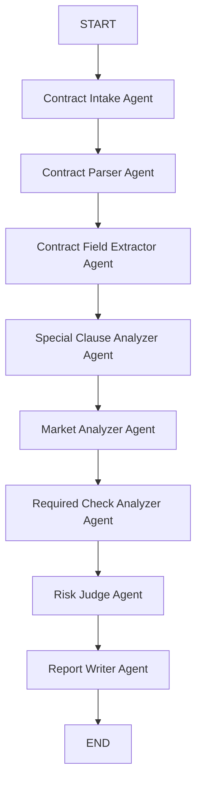
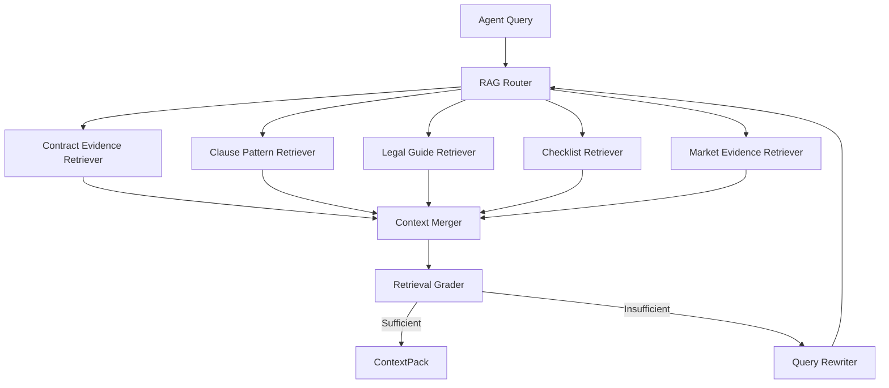
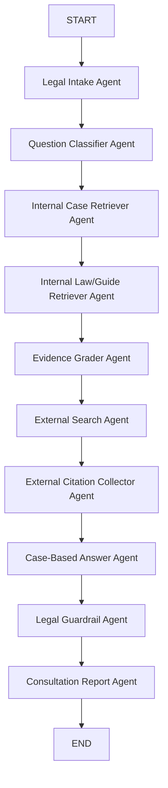

# 전세계약 진단 LangGraph / Multi-Agent 설계

## 1. 담당 범위

이 모듈은 RAG 내부 검색 로직을 직접 구현하지 않고, 전세계약 진단을 위한 LangGraph 기반 멀티 에이전트 실행 흐름을 담당한다.

- 입력: 전세계약서 1개(PDF/TXT, OCR은 추후 확장)
- 출력: 위험 점수, 위험 등급, 위험 요인, 시세 분석, 추가 확인 체크리스트, RAG 근거 요약
- RAG 연결: `common.tools.adaptive_rag.adaptive_rag()` 인터페이스를 호출한다.
- 법률자문 AI 상담사 그래프는 후순위 확장으로 분리한다.

## 2. 전체 그래프



## 3. 에이전트 목록

| Agent | 역할 | 가져오는 데이터 | 타입 | LLM 사용 |
| --- | --- | --- | --- | --- |
| Contract Intake Agent | 계약서 입력 존재 여부와 파일 형식 확인 | 사용자 업로드 계약서 경로 | Validation Agent | X |
| Contract Parser Agent | PDF/TXT에서 계약서 텍스트 추출 | 계약서 파일 | Tool Agent | X |
| Contract Field Extractor Agent | 임대인, 임차인, 주소, 보증금, 주택유형, 특약 구조화 | 계약서 텍스트 | Extraction Agent | O, 실패 시 regex fallback |
| Special Clause Analyzer Agent | 위험 특약과 빠진 방어 특약 탐지 | 계약서 특약 + RAG context | RAG-using Analysis Agent | 규칙 중심, 추후 LLM 확장 |
| Market Analyzer Agent | 전세/매매 CSV로 전세가율과 보증금 위치 분석 | `data/*.csv` | Structured Data Tool Agent | X |
| Required Check Analyzer Agent | 계약서만으로 확인 불가능한 필수 위험 항목 생성 | 체크리스트 RAG context | RAG-using Checklist Agent | X |
| Risk Judge Agent | 모든 finding을 합산해 위험 점수/등급 산정 | 앞선 agent 결과 | Rule Judge Agent | X |
| Report Writer Agent | 사용자 리포트 생성 | 전체 state + RAG 근거 | Report Agent | 현재 규칙 기반, 추후 LLM 요약 가능 |

## 4. RAG 연결 방식

Multi-Agent 파트는 RAG 내부 구현을 몰라도 되도록 다음 함수만 사용한다.

```python
adaptive_rag(
    task_type: str,
    query: str,
    filters: dict,
    top_k: int,
) -> ContextPack
```

RAG 담당자가 나중에 내부를 다음 구조로 교체할 수 있다.



## 5. 현재 데이터 연결

| 데이터 | 파일 | 사용 Agent | 용도 |
| --- | --- | --- | --- |
| 전세 실거래가 | `data/2025_전세_종로구_통합_cleaned.csv` | Market Analyzer | 주변 전세 보증금 중앙값, 보증금 percentile 계산 |
| 연립다세대 매매 | `data/fixed_연립다세대(매매)_실거래가_20260507195717.csv` | Market Analyzer | 추정 매매가 및 전세가율 계산 |
| 오피스텔 매매 | `data/fixed_오피스텔(매매)_실거래가_20260507195801.csv` | Market Analyzer | 추정 매매가 및 전세가율 계산 |
| 법령/사례/체크리스트 PDF | `docs/pdf/pdf/**` | RAG 인터페이스 | 특약 판단, 추가 확인 항목, 리포트 근거 |

## 6. 계약서만 입력받는 MVP에서 중요한 한계

계약서만으로는 다음 항목을 확정할 수 없다. 따라서 이 시스템은 해당 항목을 “위험 확정”이 아니라 “추가 확인 필요”로 표시한다.

- 등기부 갑구/을구 권리관계
- 임대인과 등기부 소유자 일치 여부
- 선순위 임차인 및 선순위 보증금
- 국세/지방세 체납
- 신탁 등기 여부
- 위반건축물 여부

## 7. 실행 예시

```powershell
$env:ENABLE_LLM='0'
python -m common.graphs.diagnosis_graph
```

Ollama를 사용할 경우 기본값은 다음과 같다.

- `OLLAMA_BASE_URL=http://localhost:11434`
- `OLLAMA_MODEL=gemma4:e2b`

## 8. 후속 수정 필요 항목

### 8.1 실제 계약서 파싱 실패 처리 개선

현재 MVP 테스트 편의를 위해 계약서 파일 경로가 없거나 PDF 파싱에 실패하면 mock 계약서 텍스트로 대체될 수 있다. 이 동작은 구조 검증용으로만 허용한다.

실서비스 또는 팀 통합 단계에서는 다음과 같이 수정해야 한다.

- 파일 경로가 없는 데모 실행에서만 mock 계약서를 사용한다.
- 사용자가 실제 계약서 파일을 업로드했는데 파일이 없거나 파싱에 실패하면 mock으로 대체하지 않고 오류 상태를 반환한다.
- OCR이 연결되기 전까지 JPG, PNG 같은 이미지 계약서는 입력 허용 목록에서 제외하거나, 명확히 "OCR 미지원" 오류를 반환한다.
- OCR/RAG 연동 이후에는 추출 실패 사유와 신뢰도를 state에 기록한다.

이 항목은 `Contract Intake Agent`, `Contract Parser Agent`, OCR 도구, RAG 문서화 로직이 연결될 때 함께 수정한다.

### 8.2 특약 분석 고도화

현재 `Special Clause Analyzer Agent`는 MVP 구조 검증을 위해 일부 키워드 기반 규칙으로 위험 특약을 탐지한다. 실제 전세사기 위험 진단 품질을 높이려면 RAG 연동 후 다음 방식으로 개선한다.

- 전세사기 예방 체크리스트, 표준계약서, 법령/가이드, 사례집에서 위험 특약 패턴을 검색한다.
- 검색된 근거 context를 기준으로 특약을 유형화한다.
- 임차인에게 불리한 조항, 빠진 방어 특약, 수정 권장 문구를 분리해서 반환한다.
- 단순 키워드 매칭이 아니라 조항의 의미를 LLM/structured output으로 판정한다.
- 최종 위험 점수는 LLM이 아니라 `Risk Judge Agent`의 규칙 기반 산정으로 유지한다.

이 항목은 RAG 담당자가 `adaptive_rag()` 내부를 실제 Adaptive/Corrective RAG로 교체한 뒤 확장한다.

## 9. 현재 Common 폴더 구조

진단 그래프와 향후 법률 정보 상담 그래프를 분리하기 위해 `common` 폴더를 graph별 구조로 정리한다.

```text
common/
  agents/
    diagnosis_nodes.py              # 전세계약 진단 그래프의 agent node
    legal_consultation_nodes.py     # 추후 법률 정보 상담 그래프 node 예정

  graphs/
    diagnosis_graph.py              # 전세계약 진단 LangGraph
    legal_consultation_graph.py     # 추후 법률 정보 상담 LangGraph 예정

  schemas/
    shared.py                       # ContextPack, RiskFinding, AgentTrace 등 공용 schema
    diagnosis.py                    # DiagnosisState, MarketAnalysis 등 진단 전용 schema
    legal_consultation.py           # 추후 법률 상담 전용 schema 예정

  tools/
    adaptive_rag.py                 # RAG 팀이 교체할 RAG boundary
    document.py                     # 계약서 PDF/TXT 파싱 및 필드 추출
    market.py                       # 전세/매매 CSV 기반 시세 분석
    llm.py                          # Ollama local LLM client
    external_search.py              # 추후 외부 검색 tool 예정
```

현재 구현된 파일은 진단 그래프 중심이며, 법률 정보 상담 그래프 파일은 다음 작업에서 추가한다.

## 10. 법률 정보 상담 그래프 설계 및 구현

법률 정보 상담 그래프는 전세계약 진단 그래프와 분리된 별도 LangGraph이다. 사용자가 특약, 보증금 반환, 대항력, 등기 위험 등에 대해 질문하면 내부 판례/법령 RAG를 우선 검색하고, 내부 근거가 부족할 경우 외부 공신력 자료를 함께 참고한다.

### 10.1 설계 원칙

- 내부 판례 RAG를 최우선으로 사용한다.
- 내부 판례가 부족하면 내부 법령, 가이드, 체크리스트를 함께 사용한다.
- 내부 근거가 불충분하면 외부 공신력 자료를 사용하고, 답변에 외부 자료 사용 사실을 명시한다.
- 답변은 판례와 법령 근거를 중심으로 작성한다.
- `승소 가능합니다`, `무조건 이깁니다` 같은 단정적 법률 자문 표현은 금지한다.
- 최종 답변에는 법률 자문이 아니라 정보 제공이라는 고지를 포함한다.

### 10.2 그래프 흐름



현재 MVP에서는 `External Search Agent`가 내부 근거가 충분하면 검색을 건너뛰고, 내부 근거가 부족하다고 판단되면 외부 공신력 자료 후보를 반환한다. 실제 웹 검색 API는 `common/tools/external_search.py` 내부를 교체해 연결한다.

### 10.3 구현 파일

```text
common/schemas/legal_consultation.py
common/agents/legal_consultation_nodes.py
common/graphs/legal_consultation_graph.py
common/tools/external_search.py
```

### 10.4 출력 구조

```json
{
  "answer": "판례/법령 근거 기반 최종 답변",
  "basis_type": "INTERNAL_CASE | INTERNAL_LAW | EXTERNAL_SOURCE | MIXED | INSUFFICIENT",
  "used_external_search": false,
  "confidence": "HIGH | MEDIUM | LOW",
  "question_type": "DEPOSIT_RETURN",
  "cited_cases": [],
  "cited_laws": [],
  "external_sources": [],
  "recommended_actions": [],
  "disclaimer": "본 답변은 법률 자문이 아니라 판례와 공공자료 기반 정보 제공입니다.",
  "agent_trace": []
}
```

### 10.5 실행 예시

```powershell
$env:ENABLE_LLM='0'
python -m common.graphs.legal_consultation_graph
```

Ollama를 사용할 경우:

```powershell
$env:ENABLE_LLM='1'
$env:OLLAMA_MODEL='gemma4:e2b'
python -m common.graphs.legal_consultation_graph
```

### 10.6 RAG 연동 시 교체 지점

현재 내부 판례/법령 검색은 `common/tools/adaptive_rag.py`의 mock context를 사용한다. RAG 팀이 실제 retriever를 연결할 때는 다음 task type을 구현하면 된다.

- `legal_case_search`: 내부 판례/판결문 검색
- `legal_law_guide_search`: 법령, 가이드, 사례집, 체크리스트 검색

외부 자료 검색은 `common/tools/external_search.py`의 `search_external_sources()`를 실제 검색 API 또는 공공기관 검색 모듈로 교체한다.

## 11. 외부 검색 API 연결 설정

법률 정보 상담 그래프의 외부 검색은 `common/tools/external_search.py`에서 관리한다. 그래프 노드는 `search_external_sources()`만 호출하므로, 외부 검색 API를 바꾸더라도 LangGraph 노드는 수정하지 않는다.

### 11.1 Provider 선택

환경변수 `EXTERNAL_SEARCH_PROVIDER`로 provider를 선택한다.

```powershell
$env:EXTERNAL_SEARCH_PROVIDER='mock'
$env:EXTERNAL_SEARCH_PROVIDER='naver'
$env:EXTERNAL_SEARCH_PROVIDER='serpapi'
$env:EXTERNAL_SEARCH_PROVIDER='custom'
```

### 11.2 Mock Provider

API 키 없이 동작하는 기본값이다. 실제 인터넷 검색은 하지 않고 공신력 있는 외부 자료 후보를 반환한다.

```powershell
$env:EXTERNAL_SEARCH_PROVIDER='mock'
```

반환 후보:

- 국가법령정보센터
- 대한법률구조공단
- 주택임대차분쟁조정위원회

### 11.3 Naver Search API Provider

Naver Search API를 사용할 경우 다음 환경변수를 설정한다.

```powershell
$env:EXTERNAL_SEARCH_PROVIDER='naver'
$env:NAVER_CLIENT_ID='발급받은-client-id'
$env:NAVER_CLIENT_SECRET='발급받은-client-secret'
```

API 키가 없거나 호출에 실패하면 mock provider 결과로 fallback한다.

### 11.4 SerpAPI Provider

Google 검색 결과가 필요하면 SerpAPI를 사용할 수 있다.

```powershell
$env:EXTERNAL_SEARCH_PROVIDER='serpapi'
$env:SERPAPI_API_KEY='발급받은-api-key'
```

### 11.5 Custom Provider

팀에서 별도 검색 API 서버를 만들 경우 다음 형식으로 연결한다.

```powershell
$env:EXTERNAL_SEARCH_PROVIDER='custom'
$env:EXTERNAL_SEARCH_ENDPOINT='https://example.com/search'
```

`custom` endpoint는 다음 query parameter를 받는다고 가정한다.

```text
q: 검색어
question_type: 질문 유형
limit: 결과 개수
```

응답은 `results` 또는 `items` 배열을 포함하면 된다.

```json
{
  "results": [
    {
      "title": "자료 제목",
      "publisher": "기관명",
      "url": "https://...",
      "summary": "핵심 요약"
    }
  ]
}
```

### 11.6 외부 검색 사용 표시

내부 RAG 근거가 부족해서 외부 검색을 사용하면 최종 리포트에 다음 값이 표시된다.

```json
{
  "used_external_search": true,
  "basis_type": "EXTERNAL_SOURCE",
  "external_sources": []
}
```

답변 본문에도 “내부 자료에서 충분한 근거를 찾지 못해 외부 공신력 자료를 함께 참고했습니다.”라는 문장이 추가된다.

## 12. Mock / 실제 구현 / 후속 교체 목록

오늘 구현한 그래프는 전세계약 진단 그래프와 법률 정보 상담 그래프 2개이다. 두 그래프 모두 LangGraph 흐름과 Agent trace는 실제로 동작한다. 다만 RAG 팀 연동 전까지 일부 검색 결과는 mock context를 사용한다.

### 12.1 실제 구현 완료

| 영역 | 상태 | 설명 |
| --- | --- | --- |
| LangGraph 실행 | 실제 구현 | `diagnosis_graph.py`, `legal_consultation_graph.py` 모두 실제 LangGraph로 실행됨 |
| Agent trace | 실제 구현 | 각 Agent 실행 순서와 입출력 요약이 report에 기록됨 |
| Ollama LLM 연동 | 실제 구현 | `gemma4:e2b` 사용 가능, `ENABLE_LLM`으로 on/off 제어 |
| PDF/TXT 계약서 파싱 | 실제 구현 | 텍스트 PDF/TXT 파싱 가능, 한글 PDF는 PyMuPDF fallback 포함 |
| 계약서 필드 추출 | 실제 구현 | LLM 사용, 실패 시 regex fallback |
| CSV 시세 분석 | 실제 구현 | `data/*.csv` 기반 전세/매매 비교 및 전세가율 추정 |
| 위험도 산정 | 실제 구현 | `Risk Judge Agent`가 rule 기반으로 점수/등급 산정 |
| 법률 상담 guardrail | 실제 구현 | 단정적 법률 자문 표현을 완화하고 disclaimer 추가 |
| 외부 API provider 구조 | 실제 구현 | `mock`, `naver`, `serpapi`, `custom` provider 선택 구조 구현 |

### 12.2 Mock 상태인 부분

| 영역 | 파일 | 현재 상태 | 후속 교체 방식 |
| --- | --- | --- | --- |
| 특약 분석 RAG | `common/tools/adaptive_rag.py` | `mock-checklist-special-clause` 반환 | 실제 체크리스트/가이드/법령 RAG retriever 연결 |
| 추가 확인 항목 RAG | `common/tools/adaptive_rag.py` | `mock-checklist-required-docs` 반환 | 실제 전세사기 체크리스트/가이드 검색 연결 |
| 리포트 근거 RAG | `common/tools/adaptive_rag.py` | `mock-guide-report` 반환 | 실제 근거 문서 chunk 출처 연결 |
| 법률 상담 판례 RAG | `common/tools/adaptive_rag.py` | `RAG_CASE_SAMPLE` 반환 | 실제 판례 DB/vector retriever 연결 |
| 법률 상담 법령 RAG | `common/tools/adaptive_rag.py` | `mock-law-housing-lease` 반환 | 실제 법령/가이드 retriever 연결 |
| 외부 검색 fallback | `common/tools/external_search.py` | API 키 없으면 공공기관 후보 mock 반환 | Naver/SerpAPI/custom API key 설정 후 실제 검색 사용 |
| 파일 없는 진단 실행 | `common/tools/document.py` | `contract_file=None`이면 `MOCK_CONTRACT_TEXT` 사용 | 실서비스에서는 실제 업로드 파일 필수로 변경 |

### 12.3 아직 미구현 또는 후속 과제

| 항목 | 상태 | 메모 |
| --- | --- | --- |
| OCR | 미구현 | 스캔 PDF, JPG, PNG 계약서 분석은 OCR 연결 후 가능 |
| 실제 판례번호/법원명 인용 | RAG 연동 필요 | 현재는 `RAG_CASE_SAMPLE`, 실제 판례 메타데이터 연결 필요 |
| 외부 API 실호출 | 키 설정 필요 | provider 구조는 구현됨. API key/env 설정 후 실호출 가능 |
| RAG 근거 충분성 고도화 | 후속 개선 | 현재는 context 개수 기반. 실제로는 relevance score/metadata 기반 grading 필요 |
| 특약 의미 기반 분석 | 후속 개선 | 현재는 일부 rule 기반. RAG+LLM structured output으로 고도화 예정 |
| 실제 파일 파싱 실패 처리 | 후속 개선 | 현재 일부 경우 mock fallback 가능. 실서비스에서는 error state 반환 필요 |

### 12.4 그래프별 상태 요약

#### 전세계약 진단 그래프

실제 동작:

- PDF/TXT 계약서 파싱
- LLM/regex 필드 추출
- 특약 rule 분석
- CSV 시세 분석
- 계약서만으로 확인 불가능한 항목 생성
- 위험도 산정
- 리포트 생성

Mock/후속 연결:

- 특약 판단 근거 RAG
- 체크리스트/법령/가이드 근거 RAG
- OCR
- 실제 파일 파싱 실패 정책

#### 법률 정보 상담 그래프

실제 동작:

- 질문 분류
- 내부 판례/법령 RAG 호출 흐름
- Evidence grading
- 내부 근거 부족 시 외부 검색 fallback 흐름
- LLM 답변 생성
- 법률 자문 guardrail
- 출처/근거/report 패키징

Mock/후속 연결:

- 내부 판례 RAG 결과
- 내부 법령/가이드 RAG 결과
- 외부 검색 API key 기반 실검색

### 12.5 외부 API 사용 방법 요약

API 키 없이 실행하면 mock fallback이 동작한다.

```powershell
$env:EXTERNAL_SEARCH_PROVIDER='mock'
```

Naver Search API를 사용할 경우:

```powershell
$env:EXTERNAL_SEARCH_PROVIDER='naver'
$env:NAVER_CLIENT_ID='발급받은-client-id'
$env:NAVER_CLIENT_SECRET='발급받은-client-secret'
```

SerpAPI를 사용할 경우:

```powershell
$env:EXTERNAL_SEARCH_PROVIDER='serpapi'
$env:SERPAPI_API_KEY='발급받은-api-key'
```

팀 자체 검색 API를 사용할 경우:

```powershell
$env:EXTERNAL_SEARCH_PROVIDER='custom'
$env:EXTERNAL_SEARCH_ENDPOINT='https://example.com/search'
```
